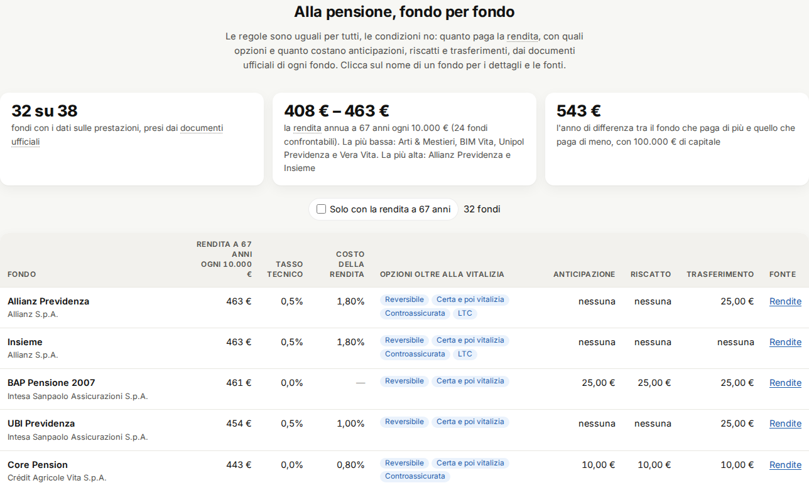
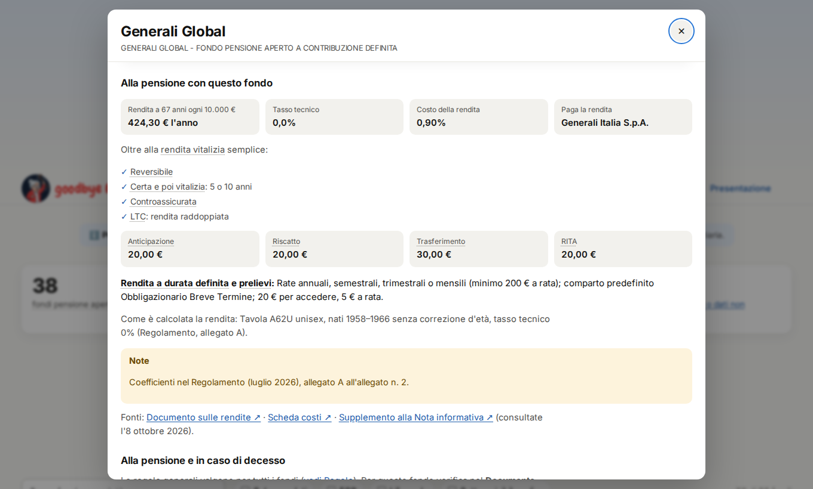
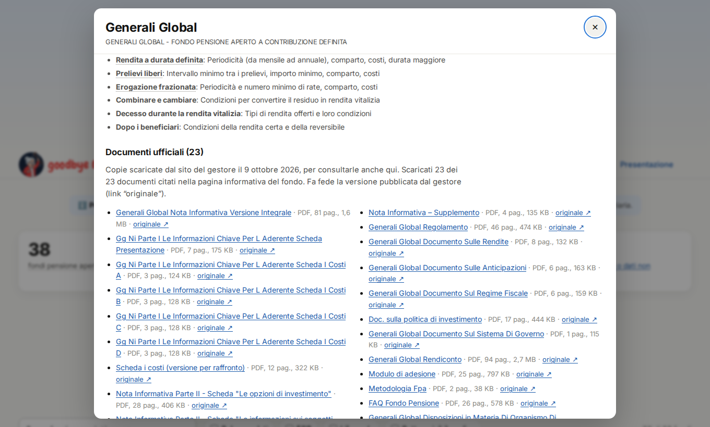
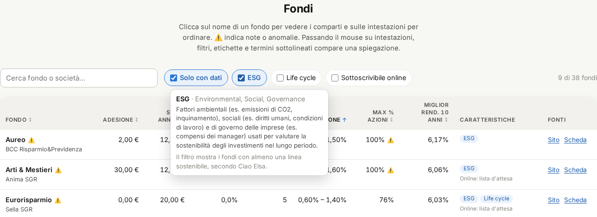
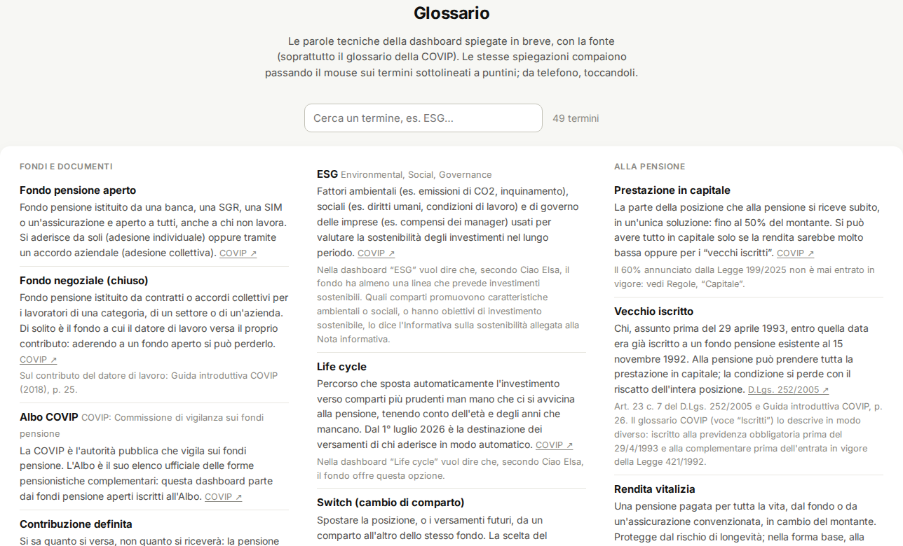

# Guida all'uso

Questa guida spiega come leggere la dashboard **Fondi pensione aperti a confronto** e, nell'ultima parte,
come aggiornare i dati e pubblicare una nuova versione.

> ℹ️ **Progetto personale**, nato per uso privato e pubblicato su GitHub a puro scopo dimostrativo: non è un servizio rivolto al pubblico. L'autore non è affiliato a COVIP, ai gestori dei fondi o a Ciao Elsa.
>
> ⚠️ **Non è consulenza finanziaria.** I dati arrivano in parte da una fonte secondaria (Ciao Elsa) e contengono
> anomalie note. Prima di aderire a un fondo leggi sempre la **Nota informativa**, la **Scheda costi** e
> l'**ISC (Indicatore Sintetico dei Costi)** pubblicati dal fondo e da [COVIP](https://www.covip.it).

Per un giro veloce c'è anche la [presentazione interattiva](../presentazione/): le frecce ← → cambiano argomento,
↑ ↓ entrano nei dettagli.

## Indice

1. [Panoramica](#panoramica)
2. [Tabella dei fondi](#tabella-dei-fondi)
3. [Dettaglio di un fondo](#dettaglio-di-un-fondo)
4. [Grafico commissione e rendimento](#grafico-commissione-e-rendimento)
5. [Confronto per categoria](#confronto-per-categoria)
6. [Regole e longevità](#regole-e-longevità)
7. [Alla pensione, fondo per fondo](#alla-pensione-fondo-per-fondo): quanto paga la rendita, opzioni e costi delle operazioni
8. [Qualità dei dati](#qualità-dei-dati)
9. [Documenti ufficiali dei fondi](#documenti-ufficiali-dei-fondi): le copie di Nota informativa, Regolamento, Documento sulle rendite e degli altri documenti
10. [Come funziona un fondo pensione](#come-funziona-un-fondo-pensione): le regole spiegate, dal TFR alla pensione e al decesso
11. [Glossario](#glossario): le parole tecniche, anche nella dashboard e nei suggerimenti al passaggio del mouse
12. [Come usare i dati per scegliere](#come-usare-i-dati-per-scegliere)
13. [Per chi mantiene il progetto](#per-chi-mantiene-il-progetto)

## Panoramica


Sotto il titolo c'è il **menu delle sezioni**, che resta fisso in alto mentre scorri ed evidenzia la sezione in cui
ti trovi: cliccando una voce ci salti direttamente. Dopo un po' di scorrimento compare in basso a destra il pulsante
**↑** per tornare all'inizio della pagina (c'è anche in questa guida).

A sinistra del menu c'è  **goodbye Elsa !!**,
il logo del progetto (Elsa che agita il bastone), che è anche l'icona della scheda del browser. È in tutte le pagine
(dashboard, guida e presentazione) e, cliccandolo, **torni sempre all'inizio della dashboard**.
Su un tablet o in una finestra stretta, se il menu completo non entra, resta solo il disegno; su telefono il nome
resta e il menu scorre di lato con il dito.

Subito dopo ci sono quattro **riquadri di riepilogo**:

| Riquadro | Significato |
|---|---|
| Fondi pensione aperti | Quanti fondi ci sono nell'[elenco dei fondi iscritti all'Albo COVIP](https://www.covip.it/la-covip-e-la-sua-attivita/albo-fondi-pensione/elenco-fondi-albo), con il filtro *Tipologia: Sezione II – Fondi pensione aperti* |
| Con dati di dettaglio | Quanti hanno costi e comparti compilati (gli altri hanno solo nome e sito) |
| Comparti | Le linee di investimento in totale, e quante hanno un rendimento a 10 anni |
| Comparti con anomalie | Quante linee hanno dati da verificare o non confrontabili (porta alla sezione Qualità dei dati) |

**Spiegazioni al passaggio del mouse**: sulle intestazioni delle colonne, sui filtri, sulle etichette e sui termini
sottolineati a puntini compare un riquadro con la definizione del [glossario](#glossario) e, dove serve, cosa mostra
quel punto della pagina. Da telefono basta toccare il termine; con la tastiera il riquadro compare sul controllo che ha
il focus e si chiude con **Esc**. Tutte le voci sono anche nella sezione **Glossario** della dashboard.

La pagina funziona anche da telefono e segue il tema chiaro o scuro del dispositivo.


## Tabella dei fondi


- **Ricerca**: scrivi parte del nome del fondo o della società (es. `amundi`, `zurich`).
- **Filtri**:
  - *Solo con dati* nasconde i fondi senza scheda;
  - *ESG* mostra i fondi con linee sostenibili;
  - *Life cycle* mostra i fondi con un percorso che riduce il rischio con l'età;
  - *Sottoscrivibile online* mostra i fondi a cui si aderisce online tramite Ciao Elsa.

  Il contatore a destra indica quanti fondi restano.
- **Ordinamento**: clicca su un'intestazione per ordinare, clicca di nuovo per invertire. I valori mancanti (—)
  restano sempre in fondo.
- **Intestazioni, filtri ed etichette**: passaci sopra con il mouse per la spiegazione (es. cosa vuol dire *ESG*, o che
  *Commissione* va dal comparto più economico al più caro del fondo).
- **⚠️** accanto al nome segnala note o anomalie: passa il mouse sopra l'icona (da telefono toccala), oppure apri il
  dettaglio, per leggerle.
  Il ⚠️ accanto a *Max % azioni* vuol dire che il valore è probabilmente falsato da un comparto con dati invertiti.
- **Comparti**: se compare il riquadro giallo "*N* dichiarate", la fonte dichiara un numero di linee diverso da quelle trovate.
- **Caratteristiche**: etichette blu per *ESG*, *Life cycle* e *Online* (sottoscrivibile online); "Online: lista d'attesa"
  in grigio. Per selezionare i fondi con queste caratteristiche usa i filtri sopra la tabella.
- **Schermi stretti**: se la tabella non entra in larghezza, scorre dentro un riquadro con l'intestazione e la colonna
  *Fondo* fisse, e la barra orizzontale resta sempre visibile.
- **Fonti**: *Sito* apre la pagina ufficiale del fondo, *Scheda* apre la scheda di Ciao Elsa da cui vengono i dati.

Le righe in grigio sono i fondi senza dati di dettaglio.

## Dettaglio di un fondo

Clicca sul nome di un fondo (nella tabella, nel grafico o nelle classifiche) per aprire il dettaglio.


- Il **riquadro giallo** riporta le note della fonte e le anomalie rilevate in automatico.
- I **costi fissi** sono: spese di adesione (una tantum), spese annue fisse e costo percentuale su ogni versamento.
- Ogni **comparto** mostra:
  - la categoria;
  - l'asset allocation, con una barra blu per le azioni e azzurra per le obbligazioni;
  - il rendimento netto medio annuo, con il **periodo** su cui è calcolato. Un'etichetta gialla indica 3 o 5 anni, non confrontabili con i 10;
  - la commissione di gestione annua;
  - le note.
- **Alla pensione con questo fondo** (per i fondi di cui abbiamo i documenti): la rendita annua a 67 anni ogni 10.000 €,
  il tasso tecnico, il costo della rendita, chi la paga, le varianti di rendita offerte, i costi di anticipazione,
  riscatto, trasferimento e RITA, le condizioni della rendita a durata definita e dei prelievi, con i link ai documenti
  ufficiali (vedi [Alla pensione, fondo per fondo](#alla-pensione-fondo-per-fondo)).
- **Alla pensione e in caso di decesso**: l'elenco di cosa verificare comunque nei documenti del fondo.
- **Documenti ufficiali**: le copie dei documenti del fondo da scaricare, con il link all'originale (vedi
  [Documenti ufficiali dei fondi](#documenti-ufficiali-dei-fondi)).
- L'indirizzo della pagina cambia (es. `…/#fondo=aureo`): puoi copiarlo per condividere direttamente quel fondo.
- Per chiudere: tasto **Esc**, il pulsante ✕ oppure un clic fuori dalla finestra.

## Grafico commissione e rendimento


Ogni punto è un **comparto**. In orizzontale c'è quanto costa ogni anno (commissione di gestione), in verticale
quanto ha reso in media ogni anno (al netto dei costi). **In alto a sinistra** ci sono i comparti economici e con il rendimento passato più alto.

- **Colori e forme** indicano la categoria: ● azionari, ▲ bilanciati, ■ obbligazionari, ◆ garantiti.
  Clicca su una voce della legenda per nasconderla o mostrarla.
- Di default ci sono **solo i rendimenti a 10 anni**. *Includi i rendimenti a 3 e 5 anni* aggiunge gli altri
  con un **simbolo vuoto**: non vanno confrontati con quelli pieni.
- **Evidenzia fondo** sbiadisce tutto tranne i comparti del fondo scelto.
- Passa il mouse su un punto per i dettagli; cliccalo per aprire il fondo.


Confronta solo punti dello **stesso colore**: un azionario rende di più di un obbligazionario perché rischia di più, non perché è "migliore".

## Confronto per categoria


Per ogni categoria (AZN, BIL, OBB, GAR) la scheda mostra:

- quanti comparti ci sono, la **commissione mediana** e il **rendimento mediano a 10 anni** (la mediana è il valore
  centrale: metà dei comparti sta sotto, metà sopra, e pochi valori estremi non la spostano);
- i comparti con la commissione più bassa e più alta;
- i comparti con il rendimento a 10 anni più alto e più basso.

La categoria OBB riunisce gli obbligazionari *misti* e *puri*. Le categorie sono quelle dichiarate dalla fonte:
alcuni comparti hanno un'asset allocation incoerente con la propria categoria, e sono segnalati con ⚠️.

## Regole e longevità

La sezione **Regole** riassume, in schede, le regole che la legge fissa per tutti i fondi pensione: versamenti e TFR,
tasse, anticipazioni e riscatti, opzioni alla pensione, decesso. Le spiegazioni complete sono nel capitolo
[Come funziona un fondo pensione](#come-funziona-un-fondo-pensione).


- **Temi**: scegli un tema con le pillole in alto (il numero indica quante regole contiene) oppure *Tutte*.
- **Solo ciò che cambia da fondo a fondo** nasconde le regole uguali ovunque: restano quelle da confrontare tra i fondi.
- Ogni scheda ha la **domanda**, il **valore chiave** in evidenza, la regola in parole semplici e, in basso:
  - *Uguale per tutti i fondi* oppure *Dipende dal fondo* (con l'elenco di cosa cambia);
  - la data di entrata in vigore, se la regola è nuova;
  - il **riferimento normativo**, che apre la fonte ufficiale (passa il mouse per vedere quale e quando è stata consultata).
- Le note in grigio segnalano le differenze tra le fonti: ad esempio, molte fonti riportano ancora il 60% in capitale
  alla pensione, ma il limite è rimasto al 50%.

Sotto le regole, **Per quanto tempo servirà il capitale?** mostra, con le tavole ISTAT 2025, quanti 67enni sono ancora
in vita a ogni età. La linea tratteggiata indica dove finisce una rendita a durata definita iniziata a 67 anni.


Nel **dettaglio di ogni fondo**, in fondo, c'è l'elenco di cosa verificare nei suoi documenti su pensione e decesso.

## Alla pensione, fondo per fondo

Le regole sono uguali per tutti i fondi, le **condizioni economiche** no. Questa sezione le mette a confronto, fondo per
fondo, con i dati presi dai documenti ufficiali dei gestori: il **Documento sulle rendite**, la **Scheda costi** della
Nota informativa e il **Supplemento alla Nota informativa** sulle nuove prestazioni (luglio 2026).



- **Rendita a 67 anni ogni 10.000 €**: quanto ti paga il fondo, il primo anno e prima delle tasse, se a 67 anni chiedi la
  rendita vitalizia con 10.000 € di capitale (con 100.000 € è dieci volte tanto). È il **coefficiente di
  trasformazione** del fondo, per una persona nata intorno al 1959 che ha aderito dopo il 2012 (coefficienti uguali per
  uomini e donne) e con la rata annuale. La tabella è ordinata da qui: in alto chi paga di più.
- **Tasso tecnico**: il rendimento che il coefficiente dà già per scontato. Con un tasso più alto (es. 0,5%) la prima
  rata è più alta, ma le rivalutazioni degli anni successivi sono più basse: due fondi con tassi diversi non si
  confrontano solo sulla prima rata.
- **Costo della rendita**: il caricamento che la compagnia trattiene per pagare la rendita, già compreso nel
  coefficiente (con la rata annuale; con rate mensili di solito è più alto).
- **Opzioni oltre alla vitalizia**: le varianti offerte (reversibile, certa e poi vitalizia, controassicurata, LTC).
  Passa il mouse su un'etichetta per il dettaglio, ad esempio la percentuale di reversibilità o gli anni di rendita certa.
- **Anticipazione, riscatto, trasferimento**: la spesa fissa per ogni operazione. *nessuna* vuol dire che non è prevista,
  *—* che non l'abbiamo trovata nei documenti.
- **Fonte**: il documento da cui viene la rendita (o la Scheda costi). Le altre fonti sono nel dettaglio del fondo.
- **Solo con la rendita a 67 anni** nasconde i fondi per cui il coefficiente non è pubblicato o non è confrontabile.

Cliccando sul nome di un fondo si apre il dettaglio, con il blocco **Alla pensione con questo fondo**:



Come leggere i numeri, e perché a volte mancano:

- **I coefficienti possono cambiare** fino al momento in cui chiedi la rendita (le compagnie possono aggiornarli, con
  preavviso, se cambiano le tavole di mortalità o i tassi): contano quelli in vigore allora. Chi ha aderito prima del
  2013 può avere coefficienti diversi.
- **Tavole diverse, rate diverse**: le tavole più vecchie (es. IPS55) ipotizzano una vita più breve e quindi danno rate
  più alte. Per questo una rata alta non è sempre sinonimo di fondo "migliore": conta anche la rivalutazione.
- **Fondi senza rendita a 67 anni**: alcuni documenti non pubblicano i coefficienti (rinviano alla convenzione con la
  compagnia), altri ne pubblicano solo un esempio con rate mensili, altri ancora usano coefficienti diversi per uomini e
  donne (UniCredit, Azimut Previdenza): sono riportati nelle note del fondo, ma non messi in classifica.
- **Coefficienti uguali tra fondi diversi**: capita quando la rendita la paga la stessa compagnia con le stesse basi (ad
  esempio i fondi del gruppo Unipol e Arti & Mestieri, oppure Core Pension e Secondapensione).
- **Fondi assenti dalla tabella**: per ora non abbiamo trovato i documenti pubblici; l'elenco è in fondo alla sezione.

## Qualità dei dati


- **Copertura**: quanti fondi hanno dati di dettaglio e quanti documenti ufficiali sono stati scaricati (vedi
  [Documenti ufficiali dei fondi](#documenti-ufficiali-dei-fondi)).
- **Documenti da recuperare**: i fondi con documenti ufficiali che non è stato possibile scaricare in automatico, con
  quanti ne mancano e perché. Clicca sul fondo per vedere l'elenco nel dettaglio.
- **Anomalie aperte**: comparti con dati sospetti o non confrontabili. Le anomalie rilevate in automatico sono:

  | Anomalia | Cosa significa |
  |---|---|
  | % azioni + % obbligazioni diversa da 100% | L'asset allocation non torna |
  | Comparto garantito/prudente con più del 50% di azioni | Quasi certamente azioni e obbligazioni sono invertite nella fonte |
  | % azioni incoerente con la categoria | Es. un "azionario" con il 30% di azioni |
  | Rendimento non a 10 anni | Calcolato su 3 o 5 anni: non confrontabile |
  | Rendimento o commissione mancante | La fonte non li riporta |

- **Fondi senza dati**: un'etichetta per fondo, che apre la sua pagina ufficiale.
- **Note sui fondi**: le prime 6 sono sempre visibili, ognuna su due righe; *Mostra tutte* apre l'elenco completo.
  Clicca sul fondo per leggere la nota per intero.
- **Fonti** usate.

I dati **non vengono corretti in silenzio**: restano come nella fonte, con la segnalazione, finché qualcuno non li verifica sulla Scheda costi ufficiale.

## Documenti ufficiali dei fondi

Per ogni fondo il sito conserva una copia dei documenti che il gestore pubblica nella pagina informativa: la **Nota
informativa** (intera e nelle sue schede, compresa la *Scheda "I costi"*), il **Supplemento** sulle nuove prestazioni,
il **Regolamento**, il **Documento sulle rendite**, i documenti sulle **anticipazioni**, sul **regime fiscale**, sulla
**politica di investimento** e sul **sistema di governo**, l'ultimo **rendiconto**, il **modulo di adesione** e le
informative sulla sostenibilità. Li trovi in fondo al dettaglio di ogni fondo, e tutti insieme nell'[elenco su
GitHub](https://github.com/andreagalle/goodbye-elsa/tree/master/docs/documenti).



- Ogni documento ha il **link alla copia** (PDF), il numero di pagine, il peso e il link **"originale"** sul sito del
  gestore. **Fa fede l'originale**: i gestori aggiornano i documenti (di solito a fine marzo e a fine luglio) e la
  copia porta la data in cui è stata scaricata.
- **"Scaricati X dei Y citati"**: Y sono i documenti collegati dalla pagina informativa ufficiale del fondo (o dalle
  pagine "Documentazione" a cui rimanda). Se la pagina non elenca documenti, le copie vengono da altre pagine dello
  stesso gestore e sono contate a parte ("trovati in altre pagine del gestore").
- **Cosa non c'è, per scelta**: la modulistica per le operazioni (richieste di riscatto, anticipazione, trasferimento…),
  le informative privacy, il materiale promozionale, le politiche del gruppo non specifiche del fondo e le versioni
  precedenti dei documenti (dei rendiconti solo l'ultimo).
- **Perché alcuni mancano**: qualche sito rifiuta i download automatici (Allianz Previdenza, Insieme, UniCredit), apre
  i documenti solo con un comando JavaScript (Teseo, Arca Previdenza), non li pubblica (Fondo Pensione Fideuram), non
  risponde (Il Melograno) o ha link che non restituiscono il PDF (parte di Eurorisparmio). Il motivo è scritto accanto a
  ogni documento non scaricato, che resta comunque raggiungibile con il link all'originale. L'elenco aggiornato è in
  [Qualità dei dati](#qualità-dei-dati), tabella *Documenti da recuperare*: chi ha i PDF può aggiungerli a mano (vedi
  [Aggiungere a mano i documenti che non si scaricano](#aggiungere-a-mano-i-documenti-che-non-si-scaricano)).
- Accanto a ogni PDF c'è il **testo estratto** (`.txt`, con `=== pagina N ===` all'inizio di ogni pagina): serve a
  cercare nei documenti e a citarli con il numero di pagina. Le tabelle possono risultare scomposte: per i numeri fa fede
  il PDF.
- La sezione [Qualità dei dati](#qualità-dei-dati) riporta quanti documenti ci sono in tutto.

## Come funziona un fondo pensione

Questo capitolo risponde alle domande più comuni su come funziona un fondo pensione e su cosa succede al momento della
pensione e in caso di decesso. Le regole sono quelle **in vigore all'8 ottobre 2026**, verificate sui testi ufficiali
elencati in fondo; la sezione [Regole](../#regole) della dashboard le riassume con il link alla fonte di ciascuna.

> La riforma della Legge di Bilancio 2026 (Legge 199/2025) ha cambiato molte regole sulle prestazioni, e alcune
> correzioni successive non sono ancora arrivate ovunque: diversi siti riportano, per esempio, il 60% in capitale,
> mentre il limite è rimasto al **50%**. In caso di dubbio fanno fede la legge e i documenti del tuo fondo.

### 1. Come funziona, nella maggior parte dei casi

Un fondo pensione è un **conto individuale**: tutto quello che versi resta tuo, separato dal patrimonio di chi gestisce
il fondo. Funziona in due fasi.

**Accumulo** (fino alla pensione)
- Si versano contributi tuoi, eventualmente del datore di lavoro, e il **TFR** se sei dipendente.
- I soldi sono investiti nel **comparto** che scegli: azionario, bilanciato, obbligazionario o garantito. In alternativa
  c'è un percorso **life cycle**, che riduce il rischio man mano che ti avvicini alla pensione.
- Il valore del conto (**posizione individuale**) cresce con i versamenti e i rendimenti, al netto dei costi. È a
  **contribuzione definita**: si sa quanto si versa, non quanto si riceverà. Non c'è un importo garantito, salvo nei
  comparti con garanzia.
- Ci sono vantaggi fiscali: contributi deducibili fino a **5.300 € l'anno** (dal 2026), rendimenti tassati al **20%**
  (12,5% sui titoli di Stato) invece del 26%.

**Erogazione** (dalla pensione)
- Si ha diritto alla prestazione quando maturano i requisiti della pensione pubblica (ad esempio quella di
  vecchiaia) e si hanno almeno **5 anni di partecipazione**.
- Non sei obbligato a chiederla subito: puoi lasciare il conto investito, e anche continuare a versare se alla data
  del pensionamento hai almeno un anno di contributi.

### 2. Il TFR: investirlo, e riaverlo prima o alla pensione

**Destinarlo al fondo**
- Il TFR è il 6,91% della retribuzione lorda annua che l'azienda accantona ogni anno.
- Dal **1° luglio 2026** chi è alla **prima assunzione** nel settore privato aderisce in automatico al fondo negoziale del
  proprio contratto, con tutto il TFR. Entro **60 giorni** può cambiare: mandare tutto il TFR a un altro fondo scelto
  liberamente (anche a uno dei fondi aperti di questa dashboard) oppure tenerlo in azienda.
- Chi era già assunto prima continua con le regole che valevano allora (scelta entro 6 mesi, silenzio-assenso).
- Puoi passare in ogni momento dal TFR in azienda al fondo, ma **non il contrario**: una volta mandato al fondo, il TFR
  futuro resta destinato alla previdenza complementare. Puoi comunque cambiare fondo.
- Attenzione al **contributo del datore di lavoro**: di solito i contratti lo prevedono solo per il fondo negoziale di
  categoria. Scegliendo un fondo aperto potresti rinunciarvi; dal 31 ottobre 2026, però, chi **trasferisce** la
  posizione ha diritto a portarsi dietro TFR e contributo del datore.

**Investirlo**
- Il TFR finisce nel comparto che hai scelto. In azienda invece si rivaluta dell'**1,5% più il 75% dell'inflazione**,
  senza rischi ma anche senza rendimenti di mercato.
- Puoi cambiare comparto nel tempo (lo *switch*), rispettando il periodo minimo previsto dal regolamento.

**Riaverlo prima della pensione**

| Motivo | Quanto | Quando | Tasse |
|---|---|---|---|
| Spese sanitarie gravissime (tue, del coniuge, dei figli) | fino al 75% | in qualsiasi momento | dal 15% al 9% |
| Acquisto o ristrutturazione della prima casa (tua o dei figli) | fino al 75% | dopo 8 anni di iscrizione | 23% |
| Altre esigenze, senza giustificare il motivo | fino al 30% | dopo 8 anni di iscrizione | 23% |
| Inoccupazione tra 12 e 48 mesi, mobilità, cassa integrazione | 50% (riscatto parziale) | quando si verifica | dal 15% al 9% |
| Invalidità che riduce la capacità di lavoro a meno di 1/3, inoccupazione oltre 48 mesi | 100% (riscatto totale) | quando si verifica | dal 15% al 9% |
| Perdita dei requisiti di partecipazione per altre cause | 100% | nelle adesioni individuali solo se perdi lo status di lavoratore | 23% |
| RITA: hai smesso di lavorare e mancano al massimo 5 anni alla pensione di vecchiaia (o 10 anni, se sei inoccupato da più di 24 mesi) | tutto o parte, **a rate** fino alla pensione | con almeno 5 anni di partecipazione | dal 15% al 9% |

- Le anticipazioni si possono chiedere più volte, fino al 75% complessivo, e **reintegrare** quando vuoi.
- Ogni prelievo riduce la pensione futura. Le aliquote "dal 15% al 9%" scendono di 0,30 punti per ogni anno di
  partecipazione oltre il quindicesimo: il 9% si raggiunge dopo 35 anni.
- Dopo 2 anni puoi **trasferire** tutta la posizione a un altro fondo, senza tasse.

### 3. Alla pensione: le opzioni

Al momento della pensione puoi prendere **fino al 50% in capitale** (meno le anticipazioni non reintegrate). Tutto il
resto va in **una sola** di queste forme:

| Forma | Come funziona | Se vivi a lungo | Alla tua morte | Tasse |
|---|---|---|---|---|
| **Rendita vitalizia** | Una pensione per tutta la vita, pagata da un'assicurazione convenzionata con il fondo | Continua finché vivi: è l'unica che protegge dal **rischio di longevità** | Nella forma base si ferma: il capitale residuo non viene restituito | dal 15% al 9% |
| **Rendita a durata definita** (dal 1/7/2026) | Rate per un numero di anni pari alla tua speranza di vita (circa 19 se inizi a 67), o di più se il fondo lo consente; il capitale resta investito nel fondo | Le rate finiscono: oltre quella durata non ricevi più nulla | Il capitale residuo va alle persone che hai indicato | dal 15% al 9% |
| **Prelievi liberi** (dal 1/7/2026) | Prelevi quando vuoi, entro le rate maturate di una rendita teorica a durata definita | Come sopra | Come sopra | dal 15% al 9% |
| **Erogazione frazionata** (dal 31/10/2026) | Rate per un periodo che scegli, di almeno 5 anni | Come sopra | Come sopra | dal 20% al 15% |

- **Tutto in capitale** si può avere solo se la rendita vitalizia ottenuta dal 70% del montante sarebbe inferiore alla
  metà dell'assegno sociale (nel 2026: circa 3.550 € l'anno), oppure se sei un "vecchio iscritto" (iscritto prima del
  29 aprile 1993 a un fondo preesistente).
- **Le tre forme nuove** sono alternative alla vitalizia: non si combinano tra loro e non si possono revocare. Il
  residuo però si può sempre convertire in rendita vitalizia, anche trasferendolo a un altro fondo.
- Durante l'erogazione non puoi più chiedere anticipazioni, RITA o trasferimenti, né versare (salvo un nuovo lavoro con
  TFR). Puoi però cambiare comparto.
- **Varianti della vitalizia**: il fondo può offrire la rendita **reversibile** (alla tua morte continua, in tutto o in
  parte, a una persona che indichi), **certa** per 5 o 10 anni e poi vitalizia, **con restituzione del capitale
  residuo** (*controassicurata*), **con copertura LTC** (una prestazione in più se perdi l'autosufficienza). Ogni
  protezione in più costa: la rata è più bassa.

#### Regola generale o condizione del fondo?

| Uguale per tutti i fondi (lo dice la legge) | Cambia da fondo a fondo (Documento sulle rendite e Supplemento alla Nota informativa) |
|---|---|
| Requisiti (pensione pubblica + 5 anni di partecipazione) | Quali varianti della vitalizia offre (reversibile, certa, controassicurata, LTC) |
| Capitale fino al 50%, e al 100% solo nei casi previsti | Compagnia che paga la vitalizia, **coefficienti di trasformazione** (quanta rendita per ogni euro), costi e rivalutazione |
| Obbligo di offrire rendita a durata definita e prelievi (frazionata dal 31/10/2026) | Periodicità delle rate, comparto in cui resta il capitale, costi delle nuove forme |
| Tasse, regole sul decesso, irrevocabilità delle nuove forme | Possibilità di una durata più lunga e condizioni per convertire il residuo in vitalizia |

Le **regole** sono uguali ovunque; le **condizioni economiche** (quanta rendita ottieni e quanto costa) no. Per
questo, prima della pensione conviene confrontare le condizioni di rendita, ed eventualmente trasferire la posizione.
La sezione [Alla pensione, fondo per fondo](#alla-pensione-fondo-per-fondo) le mette a confronto: a ottobre 2026, tra i
fondi con coefficienti confrontabili, la rendita a 67 anni va da circa 408 € a circa 463 € l'anno ogni 10.000 €, cioè
oltre 500 € l'anno di differenza con un capitale di 100.000 €.

### 4. In caso di decesso

| Quando | Chi riceve | Cosa | Tasse |
|---|---|---|---|
| **Prima della pensione** | I beneficiari che hai designato (persone o enti); se non ne hai indicati, gli eredi | Tutta la posizione | dal 15% al 9% |
| Prima della pensione, **senza beneficiari né eredi** | Finalità sociali (adesioni individuali) oppure il fondo (adesioni collettive) | Tutta la posizione | — |
| Durante la **rendita vitalizia base** | Nessuno | La rendita si ferma; il capitale residuo resta all'assicurazione e paga le rendite di chi vive più a lungo | — |
| Durante una **vitalizia reversibile** | La persona indicata | La rendita, in tutto o in parte, finché quella persona vive | da verificare |
| Durante una **vitalizia certa** (5 o 10 anni) | La persona indicata | Le rate che mancano alla fine del periodo certo | da verificare |
| Durante una **vitalizia controassicurata** | La persona indicata | Il capitale residuo non ancora pagato | da verificare |
| Durante **durata definita, prelievi o frazionata** | Le persone indicate quando hai scelto la prestazione | Il capitale residuo, rimasto investito | dal 15% al 9% |

- La designazione dei beneficiari si fa con un modulo del fondo e si può cambiare. Per le forme nuove è **obbligatoria**
  al momento della scelta.
- Secondo la COVIP chi riceve la posizione la acquisisce **a titolo proprio**, non come eredità: per esempio spetta anche
  a un erede che abbia rinunciato all'eredità.
- Per le somme pagate ai beneficiari di rendite reversibili, certe o controassicurate, la tassazione va verificata nel
  *Documento sul regime fiscale* del fondo. Per l'imposta di successione serve un professionista: dipende dal caso.

**E quando muoiono anche loro?**
- I soldi già pagati ai beneficiari (riscatto, capitale residuo, capitale preso alla pensione) diventano loro a tutti
  gli effetti: alla loro morte seguono le normali regole della loro successione.
- Le rendite invece si estinguono: una reversibile si ferma alla morte del beneficiario e non lascia nulla.
- Se muore anche il beneficiario di una rendita certa prima della fine del periodo, contano le condizioni del contratto.
- In sintesi, il capitale "si perde" solo in due casi: con la rendita vitalizia (è il prezzo dell'assicurazione contro
  la longevità) e quando non ci sono né beneficiari né eredi.

### 5. Godersi il capitale senza sapere quanto si vivrà

Il problema è reale. Secondo le tavole ISTAT 2025, a 67 anni la vita attesa è di **18,4 anni per gli uomini e 21,1 per
le donne**, ma è solo una media:
- uno su quattro muore prima di **80 anni** (uomini) o **84** (donne);
- metà supera **87** (uomini) o **90** (donne);
- uno su dieci arriva a **96** (uomini) o **98** (donne).


Chi a 67 anni sceglie la rendita a durata definita la vede finire a **86 anni**, quando è ancora vivo il **57%** delle
persone (il 50% degli uomini e il 64% delle donne). Non esiste una scelta migliore in assoluto, ma ci sono criteri
condivisi per decidere.

1. **Separa il necessario dal resto.** Le spese che dovrai sostenere comunque (casa, salute, vita quotidiana) vanno
   coperte con entrate che durano tutta la vita: la pensione pubblica, più eventualmente la rendita vitalizia. Il
   capitale e i prelievi servono per progetti, imprevisti e per quello che vuoi lasciare.
2. **Il capitale (fino al 50%) non è protetto dalla longevità.** Ha senso per spese precise (estinguere un debito, una
   riserva per le emergenze), non come pensione. Le tasse sono le stesse della rendita.
3. **La rendita vitalizia è un'assicurazione**: paga finché vivi, anche a 100 anni, e chi muore presto finanzia chi
   vive a lungo. Se ti preoccupa "perdere" il capitale, le varianti reversibile, certa o controassicurata proteggono
   partner o eredi, al prezzo di una rata più bassa.
4. **Le nuove forme danno flessibilità ed eredità, ma possono finire.** Le rate variano con i mercati e la durata
   standard copre la vita *media*. Per ridurre il rischio puoi:
   - chiedere una durata più lunga, se il fondo lo consente;
   - tenere il capitale in un comparto prudente;
   - pensare a un **approccio in due tempi**: prelievi o rate nei primi anni, poi conversione del residuo in rendita
     vitalizia a un'età più avanzata, quando ogni euro dà una rendita più alta. La legge lo consente, ma le condizioni
     le fissa il fondo.
5. **Non c'è fretta di chiedere la prestazione.** Puoi lasciare il conto investito, e continuare a versare, anche dopo
   la pensione: la rendita chiesta più tardi è più alta. Nel frattempo però il capitale resta esposto ai mercati.
6. **Se smetti di lavorare prima, valuta la RITA** come ponte fino alla pensione: rate tassate dal 15% al 9%, con il
   resto che rimane investito.
7. **Attenzione alle tasse.** Le anticipazioni per "altre esigenze" pagano il 23%, le prestazioni dal 15% al 9%;
   l'erogazione frazionata è tassata più della rendita a durata definita (dal 20% al 15%).
8. **Confronta le condizioni di rendita tra i fondi** (coefficienti, costi, varianti offerte) prima di andare in
   pensione: dopo 2 anni di partecipazione puoi trasferire la posizione dove le condizioni sono migliori.
9. **Designa i beneficiari e tienili aggiornati**, sia durante l'accumulo sia quando scegli una delle forme nuove.

Queste scelte dipendono da salute, altre entrate, patrimonio, famiglia e propensione al rischio: per una decisione
personale serve un consulente indipendente. Questa guida non è consulenza finanziaria.

#### Fonti consultate (8 ottobre 2026)

- [D.Lgs. 252/2005, testo COVIP aggiornato alla Legge 199/2025](https://www.covip.it/sites/default/files/legislazione_fondi/decreto_legislativo_5_dicembre_2005_n_252.pdf): artt. 8, 11 e 14
- [Legge 30 dicembre 2025, n. 199 (estratto COVIP)](https://www.covip.it/sites/default/files/legislazione_fondi/legge_bilancio_2026.pdf)
- [COVIP, Istruzioni sulle prestazioni, deliberazione del 25 giugno 2026](https://www.covip.it/sites/default/files/provvedimenti/istruzioni_prestazioni_25_06_2026.pdf)
- [COVIP, Esempio di supplemento alla Nota informativa per i fondi aperti (28 luglio 2026)](https://www.covip.it/sites/default/files/notizie/esempio_supplementoni_fpa.pdf)
- COVIP, FAQ su [prestazioni](https://www.covip.it/per-il-cittadino/educazione-previdenziale/faq/prestazioni), [TFR](https://www.covip.it/per-il-cittadino/educazione-previdenziale/faq/conferimento-tfr) e [trattamento fiscale](https://www.covip.it/per-il-cittadino/educazione-previdenziale/faq/trattamento-fiscale) (in parte non ancora aggiornate alla riforma)
- COVIP, risposte a quesito su [premorienza e rinuncia all'eredità](https://www.covip.it/normativa/fondi-pensione/quesiti/premorienza-rinuncia-alleredita) e sul [riscatto nelle adesioni individuali](https://www.covip.it/normativa/fondi-pensione/quesiti/risposta-quesito-tema-riscatto-della-posizione-individuale-parte)
- [COVIP, Guida introduttiva alla previdenza complementare (2018)](https://www.covip.it/sites/default/files/guidaintroduttivaallaprevidenzacomplementare.pdf), per i concetti generali
- [ISTAT, Tavole di mortalità della popolazione residente, Italia 2025](https://demo.istat.it/app/?i=TVM&l=it)

## Glossario

Le parole tecniche della dashboard, spiegate in breve. Le stesse definizioni sono nella sezione
[Glossario](../#glossario) della dashboard, con una casella per cercarle, e compaiono in un **suggerimento** quando
passi il mouse su un termine sottolineato a puntini, su un'intestazione di colonna, su un filtro o su un'etichetta
(da telefono basta toccare il termine). Con la tastiera il suggerimento compare quando il controllo riceve il focus,
e si chiude con **Esc**.



La fonte principale è il [glossario della COVIP](https://www.covip.it/per-il-cittadino/educazione-previdenziale/glossario),
aggiornato alla Legge di Bilancio 2026. Le note in corsivo dicono come il termine è usato nella dashboard o dove le
fonti non coincidono: per esempio, le categorie dei comparti (AZN, BIL, OBB, GAR) sono quelle di Ciao Elsa e non
sempre rispettano le soglie COVIP.



<!-- glossario:inizio — generato da scripts/export_xlsx.py dal foglio Glossario: non modificare a mano -->

### Fondi e documenti

| Termine | Significato | Fonte |
|---|---|---|
| **Fondo pensione aperto** | Fondo pensione istituito da una banca, una SGR, una SIM o un'assicurazione e aperto a tutti, anche a chi non lavora. Si aderisce da soli (adesione individuale) oppure tramite un accordo aziendale (adesione collettiva). | [COVIP](https://www.covip.it/per-il-cittadino/educazione-previdenziale/glossario/f#fondi-pensione-aperti) |
| **Fondo negoziale (chiuso)** | Fondo pensione istituito da contratti o accordi collettivi per i lavoratori di una categoria, di un settore o di un'azienda. Di solito è il fondo a cui il datore di lavoro versa il proprio contributo: aderendo a un fondo aperto si può perderlo.<br>*Sul contributo del datore di lavoro: Guida introduttiva COVIP (2018), p. 25.* | [COVIP](https://www.covip.it/per-il-cittadino/educazione-previdenziale/glossario/f#fondi-pensione) |
| **Albo COVIP** (COVIP: Commissione di vigilanza sui fondi pensione) | La COVIP è l'autorità pubblica che vigila sui fondi pensione. L'Albo è il suo elenco ufficiale delle forme pensionistiche complementari: questa dashboard parte dai fondi pensione aperti iscritti all'Albo. | [COVIP](https://www.covip.it/per-il-cittadino/educazione-previdenziale/glossario/a#albo-delle-forme-pensionistiche-complementari) |
| **Contribuzione definita** | Si sa quanto si versa, non quanto si riceverà: la pensione complementare dipende dai contributi versati e dai risultati degli investimenti, al netto dei costi. Non c'è un importo garantito, salvo nei comparti con garanzia. | [COVIP](https://www.covip.it/per-il-cittadino/educazione-previdenziale/glossario/f#fondi-pensione) |
| **Adesione individuale e collettiva** | Individuale: ti iscrivi tu, al fondo che scegli, qualunque lavoro tu faccia. Collettiva: l'iscrizione avviene in base a un accordo tra azienda e lavoratori, anche verso un fondo aperto. Alcune regole, per esempio sul riscatto, cambiano tra le due. | [COVIP](https://www.covip.it/per-il-cittadino/educazione-previdenziale/glossario/a#adesione) |
| **Posizione individuale (montante)** | Il valore del tuo conto nel fondo: i contributi versati più i rendimenti, meno i costi e gli eventuali prelievi. Al momento della pensione si parla anche di montante. | [COVIP](https://www.covip.it/per-il-cittadino/educazione-previdenziale/glossario/m#montante-individuale) |
| **Nota informativa** | Il documento ufficiale che descrive il fondo: comparti, costi, rendimenti passati e prestazioni. Segue uno schema fissato dalla COVIP, è pubblicato sul sito del fondo e va letto prima di aderire. In appendice c'è l'Informativa sulla sostenibilità. | [COVIP](https://www.covip.it/per-il-cittadino/educazione-previdenziale/glossario/n#nota-informativa) |
| **Scheda dei costi** | La parte della Nota informativa che elenca tutti i costi del fondo, con l'ISC. Viene consegnata prima dell'adesione: per confrontare i costi di due fondi la COVIP consiglia di confrontarne le schede.<br>*Guida introduttiva COVIP, pp. 16 e 25.* | [COVIP](https://www.covip.it/sites/default/files/guidaintroduttivaallaprevidenzacomplementare.pdf) |
| **Ciao Elsa** | Sito di Elsa Srl che spiega la previdenza complementare, confronta i fondi pensione e per alcuni fondi aperti permette di aderire online. In questa dashboard è la fonte secondaria dei dati di dettaglio: vanno verificati sulla Nota informativa. | [Ciao Elsa](https://www.ciaoelsa.com/) |
| **Sottoscrizione online** | Adesione al fondo via internet tramite Ciao Elsa, che fa da broker: identificazione con SPID o CIE e questionario di autovalutazione COVIP. “Lista d'attesa” vuol dire che il fondo non è ancora sottoscrivibile su Ciao Elsa: ci si può iscrivere per essere avvisati.<br>*La lista d'attesa è indicata nelle schede dei fondi di Ciao Elsa (es. Previdenza per Te di AXA MPS).* | [Ciao Elsa](https://www.ciaoelsa.com/sottoscrizione-fondi-pensione-su-ciao-elsa) |

### Investimento

| Termine | Significato | Fonte |
|---|---|---|
| **Comparto (linea di investimento)** | Una delle opzioni di investimento offerte dal fondo, con una propria politica di investimento e quindi un proprio livello di rischio e di rendimento atteso. Il fondo può consentire di dividere i versamenti tra più comparti. | [COVIP](https://www.covip.it/per-il-cittadino/educazione-previdenziale/glossario/c#comparto) |
| **AZN** (Azionario) | Comparto che investe solo o principalmente in azioni: nel lungo periodo può rendere di più, ma il suo valore può oscillare molto da un anno all'altro, anche in negativo. Per la COVIP un comparto è azionario se almeno il 50% è investito in azioni.<br>*Sigla della categoria usata da Ciao Elsa. Rischio e rendimento: Guida introduttiva COVIP, p. 21.* | [COVIP](https://www.covip.it/per-il-cittadino/educazione-previdenziale/glossario/m#multicomparto) |
| **BIL** (Bilanciato) | Comparto che investe sia in azioni sia in obbligazioni, in linea di massima in proporzioni simili: rischio e rendimento atteso intermedi. Per la COVIP è bilanciato un comparto con più del 30% e meno del 50% di azioni.<br>*Sigla e categoria di Ciao Elsa, che non sempre segue le soglie COVIP: diversi comparti BIL hanno il 50% di azioni o più, e per la COVIP sarebbero azionari.* | [COVIP](https://www.covip.it/per-il-cittadino/educazione-previdenziale/glossario/m#multicomparto) |
| **OBB** (Obbligazionario (misto o puro)) | Comparto che investe soprattutto in obbligazioni: rendimenti attesi più contenuti e oscillazioni ridotte. “Puro”: solo obbligazioni, niente azioni. “Misto”: anche azioni, ma al massimo il 30%.<br>*Sigle di Ciao Elsa (OBB PURO, OBB MISTO), che non sempre seguono le soglie COVIP: alcuni OBB PURO hanno una piccola quota di azioni, e molti comparti con garanzia sono classificati come OBB.* | [COVIP](https://www.covip.it/per-il-cittadino/educazione-previdenziale/glossario/m#multicomparto) |
| **GAR** (Garantito) | Comparto che garantisce la restituzione del capitale versato o un rendimento minimo, ma solo in certi casi previsti dal regolamento, per esempio al pensionamento.<br>*Ciao Elsa usa la categoria GAR per pochi comparti: molti comparti con garanzia sono classificati come obbligazionari (OBB).* | [COVIP](https://www.covip.it/per-il-cittadino/educazione-previdenziale/glossario/c#comparti-garantiti) |
| **Asset allocation** | Come è diviso il patrimonio di un comparto tra azioni (quote di società: possono rendere di più, ma oscillano molto) e obbligazioni (titoli di debito di Stati e imprese, che pagano interessi: oscillazioni più contenute). Più azioni vuol dire più rischio e più rendimento atteso nel lungo periodo.<br>*Guida introduttiva COVIP, pp. 17 e 21–22: composizione del portafoglio in titoli azionari e obbligazionari.* | [COVIP](https://www.covip.it/sites/default/files/guidaintroduttivaallaprevidenzacomplementare.pdf) |
| **ESG** (Environmental, Social, Governance) | Fattori ambientali (es. emissioni di CO2, inquinamento), sociali (es. diritti umani, condizioni di lavoro) e di governo delle imprese (es. compensi dei manager) usati per valutare la sostenibilità degli investimenti nel lungo periodo.<br>*Nella dashboard “ESG” vuol dire che, secondo Ciao Elsa, il fondo ha almeno una linea che prevede investimenti sostenibili. Quali comparti promuovono caratteristiche ambientali o sociali, o hanno obiettivi di investimento sostenibile, lo dice l'Informativa sulla sostenibilità allegata alla Nota informativa.* | [COVIP](https://www.covip.it/per-il-cittadino/educazione-previdenziale/glossario/e#esg) |
| **Life cycle** | Percorso che sposta automaticamente l'investimento verso comparti più prudenti man mano che ci si avvicina alla pensione, tenendo conto dell'età e degli anni che mancano. Dal 1° luglio 2026 è la destinazione dei versamenti di chi aderisce in modo automatico.<br>*Nella dashboard “Life cycle” vuol dire che, secondo Ciao Elsa, il fondo offre questa opzione.* | [COVIP](https://www.covip.it/per-il-cittadino/educazione-previdenziale/glossario/l#life-cycle) |
| **Switch (cambio di comparto)** | Spostare la posizione, o i versamenti futuri, da un comparto all'altro dello stesso fondo. La scelta del comparto non è vincolante, ma tra un cambio e l'altro va rispettato il periodo minimo previsto dal regolamento del fondo.<br>*Guida introduttiva COVIP, pp. 22 e 24.* | [COVIP](https://www.covip.it/sites/default/files/guidaintroduttivaallaprevidenzacomplementare.pdf) |

### Costi e rendimenti

| Termine | Significato | Fonte |
|---|---|---|
| **Spese di adesione** | Costo pagato una sola volta, quando ti iscrivi. Pesa poco se resti nel fondo a lungo, molto se ci resti pochi anni.<br>*Nella definizione dell'ISC è il “costo di iscrizione”, il cui peso diminuisce con gli anni di permanenza.* | [COVIP](https://www.covip.it/per-il-cittadino/educazione-previdenziale/glossario/i#isc-indicatore-sintetico-dei-costi) |
| **Spese annue fisse** | Importo fisso in euro prelevato ogni anno dalla posizione, qualunque sia il suo valore: pesa di più all'inizio, quando la posizione è piccola.<br>*Nella definizione dell'ISC è la “spesa annua in cifra fissa”.* | [COVIP](https://www.covip.it/per-il-cittadino/educazione-previdenziale/glossario/i#isc-indicatore-sintetico-dei-costi) |
| **Costo % sul versato** | Percentuale trattenuta da ogni versamento prima che venga investito: per esempio, lo 0,5% vuol dire 5 € ogni 1.000 € versati.<br>*Nella definizione dell'ISC è la “spesa in percentuale sui versamenti”.* | [COVIP](https://www.covip.it/per-il-cittadino/educazione-previdenziale/glossario/i#isc-indicatore-sintetico-dei-costi) |
| **Commissione di gestione** | Percentuale del patrimonio del comparto trattenuta ogni anno per gestirlo: per esempio, l'1% vuol dire 10 € l'anno ogni 1.000 € investiti. Si paga su tutto ciò che hai accumulato, quindi nel lungo periodo anche piccole differenze riducono molto la pensione.<br>*Nella definizione dell'ISC sono le “commissioni in percentuale sul patrimonio”. Effetto delle piccole differenze di costo: Guida introduttiva COVIP, p. 25.* | [COVIP](https://www.covip.it/per-il-cittadino/educazione-previdenziale/glossario/i#isc-indicatore-sintetico-dei-costi) |
| **ISC** (Indicatore sintetico dei costi) | Tutti i costi di un comparto riassunti in un'unica percentuale: di quanto riducono ogni anno il rendimento. La COVIP lo calcola allo stesso modo per tutti i fondi, per 2, 5, 10 e 35 anni di permanenza (versamento di 2.500 € l'anno, rendimento ipotetico del 4%): è il modo ufficiale per confrontare i costi tra fondi.<br>*Si trova nella Scheda dei costi di ogni fondo e nel Comparatore dei costi sul sito della COVIP.* | [COVIP](https://www.covip.it/per-il-cittadino/educazione-previdenziale/glossario/i#isc-indicatore-sintetico-dei-costi) |
| **Rendimento netto medio annuo** | Di quanto è cresciuto in media, ogni anno, il valore del comparto, già al netto di costi e tasse, su un periodo dato (qui di solito 10 anni, per alcuni comparti 3 o 5). Si confrontano solo rendimenti dello stesso periodo, e quelli passati non garantiscono quelli futuri.<br>*Guida introduttiva COVIP, p. 17 (rendimenti medi annui composti a 3, 5 e 10 anni) e p. 8 (rendimenti al netto della fiscalità).* | [COVIP](https://www.covip.it/sites/default/files/guidaintroduttivaallaprevidenzacomplementare.pdf) |

### Versamenti e uscite anticipate

| Termine | Significato | Fonte |
|---|---|---|
| **TFR** (Trattamento di fine rapporto) | La liquidazione che il datore di lavoro accantona ogni anno per il dipendente, circa il 6,91% della retribuzione lorda, e paga alla fine del rapporto di lavoro. Si può lasciare in azienda, dove si rivaluta dell'1,5% più il 75% dell'inflazione, oppure versare al fondo pensione.<br>*6,91% della retribuzione lorda: esempi della Guida introduttiva COVIP (2018).* | [COVIP](https://www.covip.it/per-il-cittadino/educazione-previdenziale/glossario/t#trattamento-di-fine-rapporto-tfr) |
| **Deducibilità** | I contributi versati al fondo (escluso il TFR) si sottraggono dal reddito su cui si calcolano le tasse, fino a 5.300 € l'anno dal 2026: si risparmia IRPEF secondo la propria aliquota.<br>*Limite annuo: Legge 199/2025 (vedi Regole, “Deducibilità”).* | [COVIP](https://www.covip.it/per-il-cittadino/educazione-previdenziale/glossario/d#deducibilit) |
| **Anticipazione** | Una parte della posizione chiesta prima della pensione per spese sanitarie gravi, per la prima casa o per altre esigenze, nei limiti di legge. Riduce la pensione futura, ma si può reintegrare rimettendo i soldi nel fondo.<br>*Limiti, tempi e tasse: vedi Regole, tema “Prima della pensione”.* | [COVIP](https://www.covip.it/per-il-cittadino/educazione-previdenziale/glossario/a#anticipazione) |
| **Riscatto** | Il ritiro in un'unica soluzione, prima della pensione, del 50% o di tutta la posizione, in casi precisi: perdita del lavoro, invalidità, perdita dei requisiti di partecipazione. In caso di decesso la posizione viene riscattata dai beneficiari o dagli eredi.<br>*Decesso: D.Lgs. 252/2005, art. 14 c. 3.* | [COVIP](https://www.covip.it/per-il-cittadino/educazione-previdenziale/glossario/r#riscatto) |
| **RITA** (Rendita integrativa temporanea anticipata) | La posizione pagata a rate fino all'età della pensione di vecchiaia, per chi ha smesso di lavorare e ne è vicino: al massimo 5 anni, o 10 se è senza lavoro da più di 24 mesi. Servono almeno 5 anni di partecipazione. | [COVIP](https://www.covip.it/per-il-cittadino/educazione-previdenziale/glossario/r#rita-rendita-integrativa-temporanea-anticipata) |
| **Trasferimento** | Spostare tutta la posizione in un altro fondo pensione: si può dopo 2 anni di iscrizione, o prima se cambi lavoro. Non si pagano tasse e l'anzianità di iscrizione si conserva.<br>*Il fondo che lasci può applicare una spesa fissa per il trasferimento.* | [COVIP](https://www.covip.it/per-il-cittadino/educazione-previdenziale/glossario/t#trasferimento) |

### Alla pensione

| Termine | Significato | Fonte |
|---|---|---|
| **Prestazione in capitale** | La parte della posizione che alla pensione si riceve subito, in un'unica soluzione: fino al 50% del montante. Si può avere tutto in capitale solo se la rendita sarebbe molto bassa oppure per i “vecchi iscritti”.<br>*Il 60% annunciato dalla Legge 199/2025 non è mai entrato in vigore: vedi Regole, “Capitale”.* | [COVIP](https://www.covip.it/per-il-cittadino/educazione-previdenziale/glossario/p#prestazione-pensionistica-complementare) |
| **Vecchio iscritto** | Chi, assunto prima del 29 aprile 1993, entro quella data era già iscritto a un fondo pensione esistente al 15 novembre 1992. Alla pensione può prendere tutta la prestazione in capitale; la condizione si perde con il riscatto dell'intera posizione.<br>*Art. 23 c. 7 del D.Lgs. 252/2005 e Guida introduttiva COVIP, p. 26. Il glossario COVIP (voce “Iscritti”) lo descrive in modo diverso: iscritto alla previdenza obbligatoria prima del 29/4/1993 e alla complementare prima dell'entrata in vigore della Legge 421/1992.* | [D.Lgs. 252/2005](https://www.covip.it/sites/default/files/legislazione_fondi/decreto_legislativo_5_dicembre_2005_n_252.pdf) |
| **Rendita vitalizia** | Una pensione pagata per tutta la vita, dal fondo o da un'assicurazione convenzionata, in cambio del montante. Protegge dal rischio di longevità; nella forma base, alla morte il capitale residuo non viene restituito.<br>*Forma base e varianti: Esempio COVIP di supplemento alla Nota informativa (28/7/2026).* | [COVIP](https://www.covip.it/per-il-cittadino/educazione-previdenziale/glossario/r#rendita-vitalizia) |
| **Coefficiente di trasformazione** | Il numero che trasforma il montante in rendita annua. Dipende dall'età alla pensione, dalla speranza di vita, dal tasso tecnico e dai costi, e cambia da fondo a fondo: a parità di montante, un coefficiente più alto dà una rendita più alta.<br>*Da cosa dipende: Guida introduttiva COVIP, p. 27.* | [COVIP](https://www.covip.it/per-il-cittadino/educazione-previdenziale/glossario/c#coefficiente-di-trasformazione-in-rendita) |
| **Tasso tecnico** | Il rendimento minimo garantito considerato nel calcolo della rendita, al momento in cui viene fissata. È uno degli elementi del coefficiente di trasformazione.<br>*Guida introduttiva COVIP, p. 27.* | [COVIP](https://www.covip.it/sites/default/files/guidaintroduttivaallaprevidenzacomplementare.pdf) |
| **Rendita reversibile** | Rendita vitalizia che, alla tua morte, continua in tutto o in parte a una persona che hai indicato. La rata è più bassa di quella della rendita vitalizia base. | [COVIP](https://www.covip.it/sites/default/files/notizie/esempio_supplementoni_fpa.pdf) |
| **Rendita certa e poi vitalizia** | Rendita pagata comunque per un numero definito di anni, anche alla persona che hai indicato se muori prima, e poi per tutta la vita. La rata è più bassa di quella della rendita vitalizia base. | [COVIP](https://www.covip.it/sites/default/files/notizie/esempio_supplementoni_fpa.pdf) |
| **Rendita controassicurata** | Rendita vitalizia con restituzione del capitale: alla tua morte, la persona che hai indicato riceve il capitale residuo non ancora pagato. La rata è più bassa di quella della rendita vitalizia base. | [COVIP](https://www.covip.it/sites/default/files/notizie/esempio_supplementoni_fpa.pdf) |
| **LTC** (Long-term care) | Copertura assicurativa abbinata alla rendita, che la aumenta se si perde l'autosufficienza.<br>*Rendita con copertura LTC: Guida introduttiva COVIP, p. 27.* | [COVIP](https://www.covip.it/per-il-cittadino/educazione-previdenziale/glossario/l#long-term-care) |
| **Rendita a durata definita** | Dal 1° luglio 2026, alternativa alla vitalizia: rate per un numero di anni pari alla vita attesa secondo le tavole ISTAT. Il capitale resta investito, ogni rata è il residuo diviso per le rate che mancano, e alla morte il residuo va ai beneficiari.<br>*Non protegge da una vita più lunga del previsto: vedi Regole e il grafico della longevità.* | [COVIP](https://www.covip.it/per-il-cittadino/educazione-previdenziale/glossario/p#prestazione-pensionistica-complementare) |
| **Prelievi liberi** (Prelievi liberamente determinabili) | Dal 1° luglio 2026, alternativa alla vitalizia: prelevi quando vuoi, entro la somma delle rate maturate e non ancora riscosse di una rendita teorica a durata definita. Il resto resta investito. | [COVIP](https://www.covip.it/per-il-cittadino/educazione-previdenziale/glossario/p#prestazione-pensionistica-complementare) |
| **Erogazione frazionata** | Dal 31 ottobre 2026: il montante pagato a rate per un periodo che scegli tu, di almeno 5 anni, indipendente dalla speranza di vita. Ha una tassazione meno favorevole delle altre forme.<br>*Tassazione: vedi Regole, “Tasse sulle prestazioni”.* | [COVIP](https://www.covip.it/per-il-cittadino/educazione-previdenziale/glossario/p#prestazione-pensionistica-complementare) |
| **Documento sulle rendite** | Documento del fondo che spiega nel dettaglio le prestazioni in rendita e, dal 2026, come si calcolano le rate e i prelievi delle nuove forme. | [COVIP](https://www.covip.it/sites/default/files/provvedimenti/istruzioni_prestazioni_25_06_2026.pdf) |
| **Supplemento alla Nota informativa** | Documento che dal 2026 ogni fondo pubblica sul proprio sito per descrivere le prestazioni: tipi di rendita e nuove forme offerti, con condizioni e costi. Serve a confrontare i fondi in vista della pensione.<br>*La COVIP ne ha pubblicato un esempio per i fondi aperti il 28/7/2026.* | [COVIP](https://www.covip.it/sites/default/files/provvedimenti/istruzioni_prestazioni_25_06_2026.pdf) |

### Longevità e decesso

| Termine | Significato | Fonte |
|---|---|---|
| **Rischio di longevità** | Il rischio di vivere più a lungo del previsto e di finire i risparmi. La rendita vitalizia protegge da questo rischio; il capitale e le nuove forme a rate no.<br>*Guida introduttiva COVIP, pp. 26–27.* | [COVIP](https://www.covip.it/per-il-cittadino/educazione-previdenziale/glossario/r#rischio-di-longevit) |
| **Speranza di vita** | Quanti anni, in media, vive ancora chi ha raggiunto una certa età. È una media: molte persone vivono più a lungo. | [COVIP](https://www.covip.it/per-il-cittadino/educazione-previdenziale/glossario/s#speranza-di-vita-allet-x) |
| **Tavole di mortalità** | Statistiche su quante persone sopravvivono a ogni età, per età e sesso; in Italia le pubblica l'ISTAT. Servono a calcolare la speranza di vita, i coefficienti della rendita vitalizia e la durata della rendita a durata definita. | [COVIP](https://www.covip.it/per-il-cittadino/educazione-previdenziale/glossario/t#tavole-di-mortalit) |
| **Beneficiari designati** | Le persone, o gli enti, che indichi al fondo perché ricevano la posizione se muori prima della pensione, o il capitale residuo delle nuove forme a rate. Se non ne indichi, la posizione va agli eredi.<br>*Art. 14 c. 3. Per le nuove forme indicarli è obbligatorio (Istruzioni COVIP del 25/6/2026).* | [D.Lgs. 252/2005](https://www.covip.it/sites/default/files/legislazione_fondi/decreto_legislativo_5_dicembre_2005_n_252.pdf) |

<!-- glossario:fine -->

## Come usare i dati per scegliere

1. **Parti dal tuo orizzonte**: quanti anni mancano alla pensione? Più è lungo, più rischio puoi sostenere.
2. **Scegli la categoria**, poi confronta **solo comparti della stessa categoria**, nel grafico o nelle schede.
3. **Guarda i costi**: su 30 anni anche lo 0,5% in più all'anno pesa molto sul capitale finale.
4. **Non inseguire il rendimento passato**: è un indizio, non una promessa. Diffida dei confronti tra periodi diversi.
5. **Controlla le ⚠️** e verifica sempre su Nota informativa, Scheda costi e ISC del fondo.
6. Valuta anche il **fondo negoziale** della tua categoria, se esiste: spesso costa meno e c'è il contributo del datore di lavoro.
7. **Pensa anche all'uscita**: tipi di rendita offerti, coefficienti e costi della fase di erogazione cambiano da fondo
   a fondo (vedi [Alla pensione, fondo per fondo](#alla-pensione-fondo-per-fondo) e
   [Alla pensione: le opzioni](#3-alla-pensione-le-opzioni)).

## Per chi mantiene il progetto

### Aggiornare i dati

1. Modifica `data/fondi-pensione-covip.xlsx` **in Excel** e salva: le formule si ricalcolano e i valori restano in cache.
   Nel devcontainer puoi aprire il file in sola lettura con l'estensione *Spreadsheet Viewer*. Se lo modifichi da Python,
   salvalo con `scripts/workbook_utils.salva()`: calcola le formule e ne mette i valori in cache come farebbe Excel
   (e conserva il collegamento a Claude per Excel), quindi non serve riaprirlo in Excel.
2. Rigenera i JSON: `python scripts/export_xlsx.py`. Lo script si ferma se trova errori di schema.
3. Esegui i test: `python -m unittest discover -s tests -v`.

Il **glossario** si modifica nel foglio `Glossario` (una riga per termine, con fonte e data di consultazione). L'export
scrive `glossario.json` per la dashboard e rigenera la tabella del capitolo [Glossario](#glossario), tra i commenti
`glossario:inizio` e `glossario:fine`: quella parte di questa guida non va modificata a mano. Nella dashboard un
termine si collega a una voce con l'attributo `data-glossario="<ID>"` (es. `data-glossario="esg"`).

Le **condizioni alla pensione** stanno nel foglio `Prestazioni`: una riga per fondo, con la colonna A collegata al nome
in `Sheet1` (`=Sheet1!$A$n`). Si compilano dal Documento sulle rendite, dalla Scheda costi e dal Supplemento alla Nota
informativa (con l'hyperlink al documento e la data di consultazione); le colonne *N. varianti* e *Tasso di
conversione* sono formule. La rendita a 67 anni si riporta solo se è confrontabile (rata annuale, coefficienti unisex,
nato intorno al 1959): altrimenti resta vuota e il motivo va nelle note. L'export scrive `prestazioni.json`.

### Aggiornare i documenti ufficiali dei fondi

Il registro è `data/documenti.csv`: una riga per documento, con fondo, tipo, titolo come compare sul sito del gestore,
nome del file, link di download, pagina che lo cita (vuota = la pagina informativa del fondo), *citato nella pagina
ufficiale* (Sì/No) e, se il documento non è scaricato, il motivo nelle note. Una riga di tipo `nota-fondo` contiene una
nota sul fondo intero (es. "sito non raggiungibile").

```bash
python scripts/documenti.py scarica            # scarica i PDF del registro che mancano ed estrae il testo
python scripts/documenti.py scarica --aggiorna # riscarica tutto (nuove edizioni)
python scripts/documenti.py riprova            # riprova i documenti non scaricati e aggiorna il registro
python scripts/documenti.py indice             # rigenera data/documenti.json e docs/documenti/README.md
```

- `riprova` è utile per i siti che bloccano i download automatici o limitano le richieste ravvicinate: lancialo dal tuo
  computer (un'altra rete) o con `--browser` (Chromium), con `--pausa 20` se il sito si blocca dopo poche richieste.
- Per aggiungere un documento: aggiungi la riga al registro con un nome di file nuovo (minuscole e trattini, `.pdf`), poi
  `scarica` e `indice`. I test (`tests/test_documenti.py`) controllano che registro, PDF, testi e indice siano coerenti.
- I PDF pesano oltre 400 MB: non finiscono nello zip del sito allegato alle release (c'è `documenti.json`, con gli
  SHA-256), ma restano nel repository e sul sito.

#### Aggiungere a mano i documenti che non si scaricano

Per i siti che bloccano gli script o aprono i documenti solo con JavaScript (la tabella *Documenti da recuperare* in
Qualità dei dati dice quali), scarica i PDF dal browser e mettili nella cartella `documenti-da-smistare/` del repository,
anche con il nome che hanno. Se vuoi essere sicuro del fondo, mettili in una sottocartella con il suo id (es.
`documenti-da-smistare/teseo/`). Poi:

```bash
python scripts/documenti.py smista            # anteprima: per ogni PDF, fondo e tipo riconosciuti e dove andrebbe
python scripts/documenti.py smista --applica  # lo sposta in docs/documenti/<fondo>/, estrae il testo, aggiorna il registro
python scripts/documenti.py indice
```

Lo smistamento riconosce il fondo dal nome del file e dalle prime pagine e il tipo dal titolo, e abbina il PDF al
documento mancante più simile del registro, che risulterà "copia fornita a mano" con la data. Se il fondo non è chiaro
(documenti comuni a più fondi dello stesso gestore, come il regime fiscale di Intesa Sanpaolo), il PDF resta nella
cartella e va messo nella sottocartella del fondo. I file della cartella non si committano per errore: sono ignorati
da git.

### Provare il sito prima di pubblicarlo

```bash
./scripts/anteprima.sh          # export + test + server su http://localhost:8000
./scripts/anteprima.sh --veloce # senza test
```

In VS Code puoi anche usare *Terminale → Esegui attività… → Anteprima GitHub Page*. In Codespaces la porta 8000 viene
inoltrata in automatico e si apre l'anteprima.

### Pubblicare: pull request → deploy → release

1. Lavora su un branch (es. `dev`) e apri una **pull request verso `master`**. La CI esegue export, test e smoke test
   del sito, e scrive nel riepilogo la **versione che verrà pubblicata**.
2. Al **merge** il workflow *Deploy GitHub Page e release*:
   - calcola la nuova versione;
   - pubblica il sito su GitHub Pages;
   - crea il tag `vX.Y.Z` e la release, con le note generate dai commit (una voce per commit; se un commit ne
     riunisce altri, anche per ogni loro titolo che nel messaggio sta a inizio riga, come `sito: …` o `dati: …`;
     le voci di elenco `- …` restano dettagli) e in allegato i dati della versione
     (JSON), il workbook Excel, lo zip del sito pubblicato e i checksum SHA-256. Gli allegati si scaricano dalla
     pagina [Releases](https://github.com/andreagalle/goodbye-elsa/releases/latest) del repository. La sezione
     *Packages* di GitHub è un'altra cosa: un registro per pacchetti npm, Maven, immagini Docker e simili, che qui
     resta vuoto.
3. Regole di versione:
   - **minor** se c'è almeno un commit `sito:`, `script:` o `feat:` (anche tra quelli riuniti in un altro commit);
   - **patch** per tutto il resto (`dati:`, `docs:`, `fix:`, `ci:`…);
   - la **major** non viene mai incrementata in automatico: solo con la label `release:major` sulla PR o
     con l'avvio manuale del workflow, e solo su decisione del responsabile del progetto.

### Aggiornare guida, presentazione e screenshot

```bash
python scripts/screenshots.py   # rigenera docs/guida/img/ con i dati correnti
python scripts/icone.py         # logo e favicon (docs/img/) dall'originale assets/elsa.png
```

Ogni modifica alla dashboard deve aggiornare insieme questa guida (`docs/guida/GUIDA.md`), la presentazione
(`docs/presentazione/index.html`), gli screenshot e `CLAUDE.md`.
