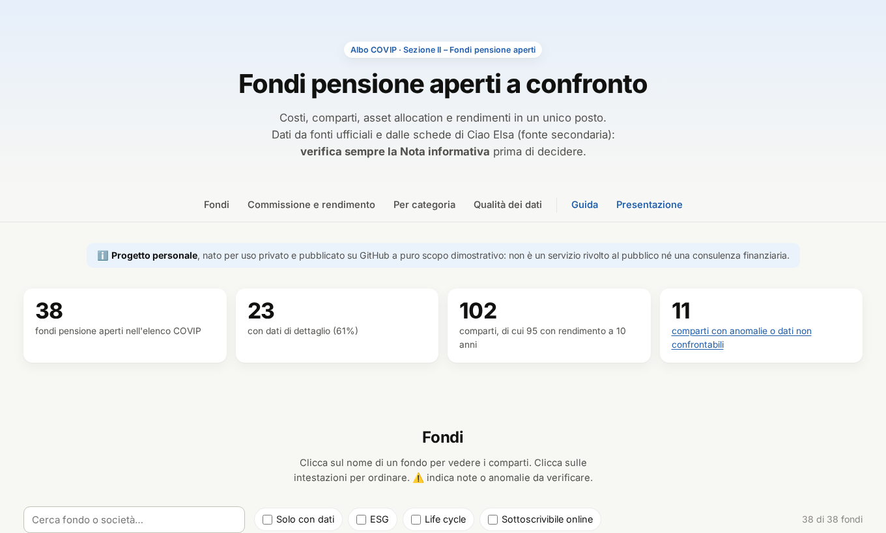
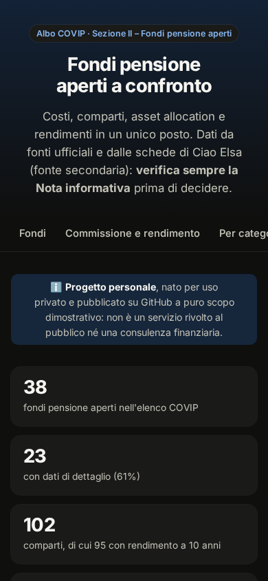
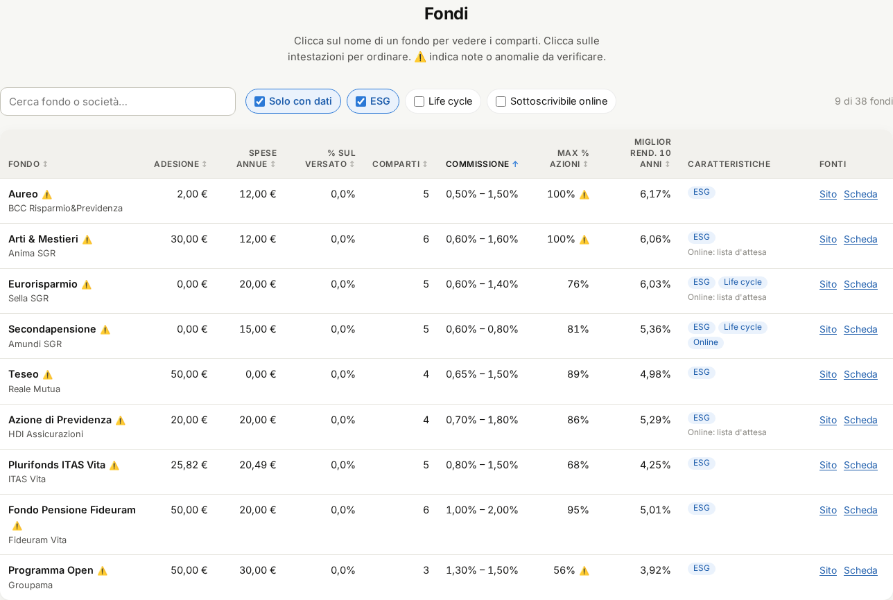
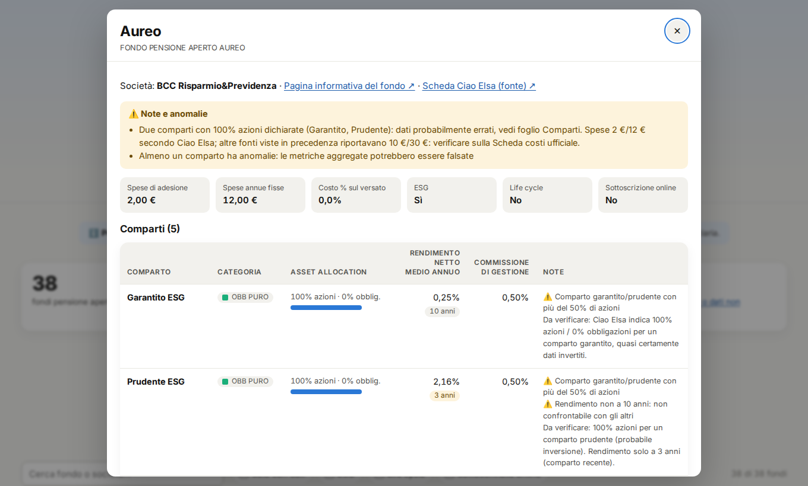
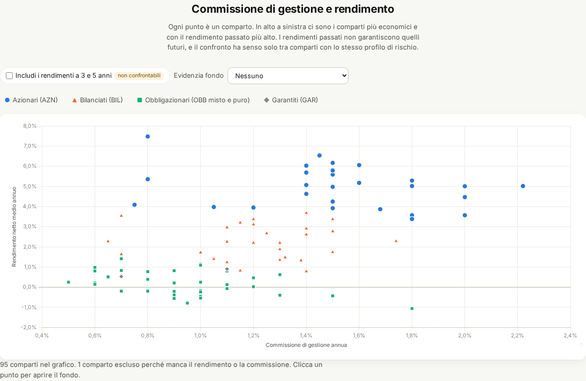
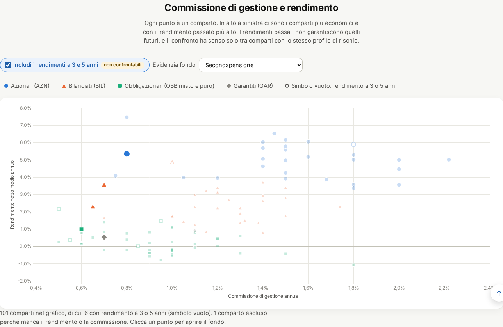
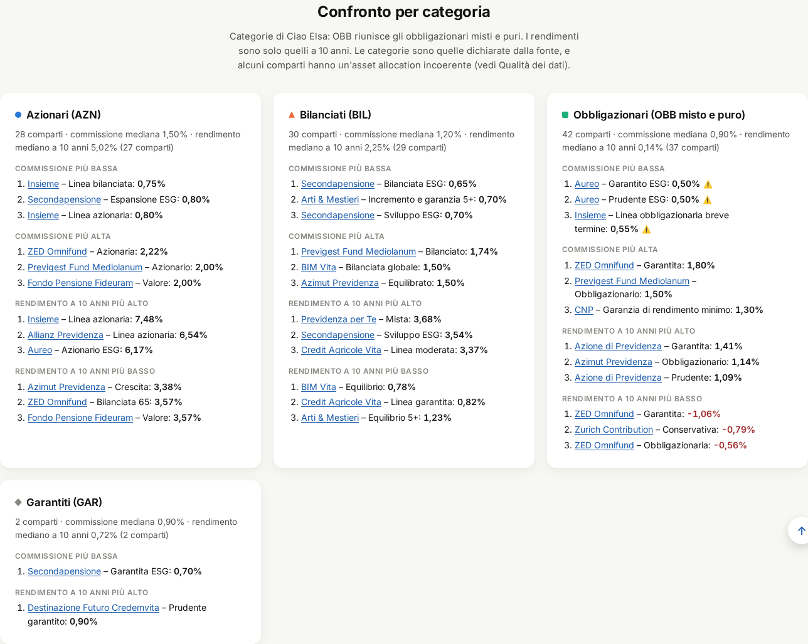
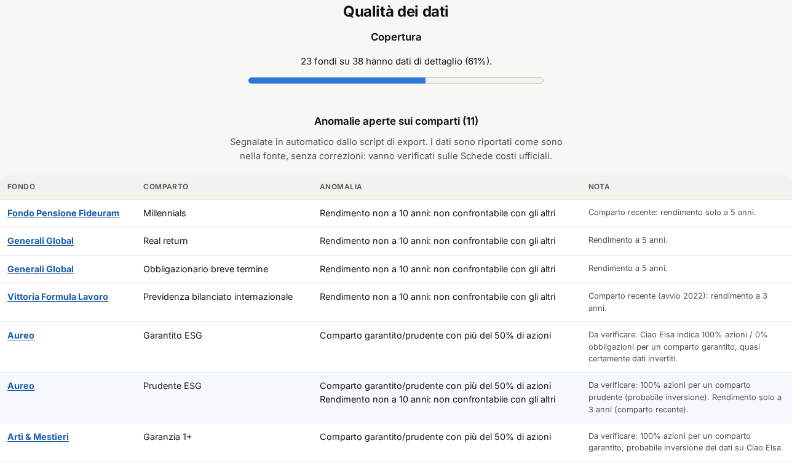

# Guida all'uso

Questa guida spiega come leggere la dashboard **Fondi pensione aperti a confronto** e, nell'ultima parte,
come aggiornare i dati e pubblicare una nuova versione.

> ℹ️ **Progetto personale**, nato per uso privato e pubblicato su GitHub a puro scopo dimostrativo: non è un servizio rivolto al pubblico. L'autore non è affiliato a COVIP, ai gestori dei fondi o a Ciao Elsa.
>
> ⚠️ **Non è consulenza finanziaria.** I dati arrivano in parte da una fonte secondaria (Ciao Elsa) e contengono
> anomalie note. Prima di aderire a un fondo leggi sempre la **Nota informativa**, la **Scheda costi** e
> l'**ISC (Indicatore Sintetico dei Costi)** pubblicati dal fondo e da [COVIP](https://www.covip.it).

Per un giro veloce c'è anche la [presentazione interattiva](../presentazione/): le frecce ← → cambiano argomento,
↑ ↓ entrano nei dettagli.

## Indice

1. [Panoramica](#panoramica)
2. [Tabella dei fondi](#tabella-dei-fondi)
3. [Dettaglio di un fondo](#dettaglio-di-un-fondo)
4. [Grafico commissione e rendimento](#grafico-commissione-e-rendimento)
5. [Confronto per categoria](#confronto-per-categoria)
6. [Qualità dei dati](#qualità-dei-dati)
7. [Glossario](#glossario)
8. [Come usare i dati per scegliere](#come-usare-i-dati-per-scegliere)
9. [Per chi mantiene il progetto](#per-chi-mantiene-il-progetto)

## Panoramica



Sotto il titolo c'è il **menu delle sezioni**, che resta fisso in alto mentre scorri ed evidenzia la sezione in cui
ti trovi: cliccando una voce ci salti direttamente. Dopo un po' di scorrimento compare in basso a destra il pulsante
**↑** per tornare all'inizio della pagina (c'è anche in questa guida).

Subito dopo ci sono quattro **riquadri di riepilogo**:

| Riquadro | Significato |
|---|---|
| Fondi pensione aperti | Quanti fondi ci sono nell'[elenco dei fondi iscritti all'Albo COVIP](https://www.covip.it/la-covip-e-la-sua-attivita/albo-fondi-pensione/elenco-fondi-albo), con il filtro *Tipologia: Sezione II – Fondi pensione aperti* |
| Con dati di dettaglio | Quanti hanno costi e comparti compilati (gli altri hanno solo nome e sito) |
| Comparti | Le linee di investimento in totale, e quante hanno un rendimento a 10 anni |
| Comparti con anomalie | Quante linee hanno dati da verificare o non confrontabili (porta alla sezione Qualità dei dati) |

La pagina funziona anche da telefono e segue il tema chiaro o scuro del dispositivo.



## Tabella dei fondi



- **Ricerca**: scrivi parte del nome del fondo o della società (es. `amundi`, `zurich`).
- **Filtri**:
  - *Solo con dati* nasconde i fondi senza scheda;
  - *ESG* mostra i fondi con linee sostenibili;
  - *Life cycle* mostra i fondi con un percorso che riduce il rischio con l'età;
  - *Sottoscrivibile online* mostra i fondi a cui si aderisce online tramite Ciao Elsa.

  Il contatore a destra indica quanti fondi restano.
- **Ordinamento**: clicca su un'intestazione per ordinare, clicca di nuovo per invertire. I valori mancanti (—)
  restano sempre in fondo.
- **⚠️** accanto al nome segnala note o anomalie: passa il mouse sopra l'icona, oppure apri il dettaglio, per leggerle.
  Il ⚠️ accanto a *Max % azioni* vuol dire che il valore è probabilmente falsato da un comparto con dati invertiti.
- **Comparti**: se compare il riquadro giallo "*N* dichiarate", la fonte dichiara un numero di linee diverso da quelle trovate.
- **Caratteristiche**: etichette blu per *ESG*, *Life cycle* e *Online* (sottoscrivibile online); "Online: lista d'attesa"
  in grigio. Per selezionare i fondi con queste caratteristiche usa i filtri sopra la tabella.
- **Schermi stretti**: se la tabella non entra in larghezza, scorre dentro un riquadro con l'intestazione e la colonna
  *Fondo* fisse, e la barra orizzontale resta sempre visibile.
- **Fonti**: *Sito* apre la pagina ufficiale del fondo, *Scheda* apre la scheda di Ciao Elsa da cui vengono i dati.

Le righe in grigio sono i fondi senza dati di dettaglio.

## Dettaglio di un fondo

Clicca sul nome di un fondo (nella tabella, nel grafico o nelle classifiche) per aprire il dettaglio.



- Il **riquadro giallo** riporta le note della fonte e le anomalie rilevate in automatico.
- I **costi fissi** sono: spese di adesione (una tantum), spese annue fisse e costo percentuale su ogni versamento.
- Ogni **comparto** mostra:
  - la categoria;
  - l'asset allocation, con una barra blu per le azioni e azzurra per le obbligazioni;
  - il rendimento netto medio annuo, con il **periodo** su cui è calcolato. Un'etichetta gialla indica 3 o 5 anni, non confrontabili con i 10;
  - la commissione di gestione annua;
  - le note.
- L'indirizzo della pagina cambia (es. `…/#fondo=aureo`): puoi copiarlo per condividere direttamente quel fondo.
- Per chiudere: tasto **Esc**, il pulsante ✕ oppure un clic fuori dalla finestra.

## Grafico commissione e rendimento



Ogni punto è un **comparto**. In orizzontale c'è quanto costa ogni anno (commissione di gestione), in verticale
quanto ha reso in media ogni anno (al netto dei costi). **In alto a sinistra** ci sono i comparti economici e con il rendimento passato più alto.

- **Colori e forme** indicano la categoria: ● azionari, ▲ bilanciati, ■ obbligazionari, ◆ garantiti.
  Clicca su una voce della legenda per nasconderla o mostrarla.
- Di default ci sono **solo i rendimenti a 10 anni**. *Includi i rendimenti a 3 e 5 anni* aggiunge gli altri
  con un **simbolo vuoto**: non vanno confrontati con quelli pieni.
- **Evidenzia fondo** sbiadisce tutto tranne i comparti del fondo scelto.
- Passa il mouse su un punto per i dettagli; cliccalo per aprire il fondo.



Confronta solo punti dello **stesso colore**: un azionario rende di più di un obbligazionario perché rischia di più, non perché è "migliore".

## Confronto per categoria



Per ogni categoria (AZN, BIL, OBB, GAR) la scheda mostra:

- quanti comparti ci sono, la **commissione mediana** e il **rendimento mediano a 10 anni**;
- i comparti con la commissione più bassa e più alta;
- i comparti con il rendimento a 10 anni più alto e più basso.

La categoria OBB riunisce gli obbligazionari *misti* e *puri*. Le categorie sono quelle dichiarate dalla fonte:
alcuni comparti hanno un'asset allocation incoerente con la propria categoria, e sono segnalati con ⚠️.

## Qualità dei dati



- **Copertura**: quanti fondi hanno dati di dettaglio.
- **Anomalie aperte**: comparti con dati sospetti o non confrontabili. Le anomalie rilevate in automatico sono:

  | Anomalia | Cosa significa |
  |---|---|
  | % azioni + % obbligazioni diversa da 100% | L'asset allocation non torna |
  | Comparto garantito/prudente con più del 50% di azioni | Quasi certamente azioni e obbligazioni sono invertite nella fonte |
  | % azioni incoerente con la categoria | Es. un "azionario" con il 30% di azioni |
  | Rendimento non a 10 anni | Calcolato su 3 o 5 anni: non confrontabile |
  | Rendimento o commissione mancante | La fonte non li riporta |

- **Fondi senza dati**: un'etichetta per fondo, che apre la sua pagina ufficiale.
- **Note sui fondi**: le prime 6 sono sempre visibili, ognuna su due righe; *Mostra tutte* apre l'elenco completo.
  Clicca sul fondo per leggere la nota per intero.
- **Fonti** usate.

I dati **non vengono corretti in silenzio**: restano come nella fonte, con la segnalazione, finché qualcuno non li verifica sulla Scheda costi ufficiale.

## Glossario

| Termine | Significato |
|---|---|
| **Fondo pensione aperto** | Fondo di previdenza complementare istituito da banche, assicurazioni o SGR, aperto a tutti |
| **Comparto / linea** | Una delle opzioni di investimento del fondo, ognuna con un proprio profilo di rischio |
| **AZN** | Azionario: in prevalenza azioni, rischio e potenziale di rendimento più alti |
| **BIL** | Bilanciato: un mix di azioni e obbligazioni |
| **OBB misto / puro** | Obbligazionario: soprattutto (misto) o solo (puro) obbligazioni |
| **GAR** | Garantito: restituzione del capitale (o un rendimento minimo) in certi casi previsti dal regolamento |
| **Commissione di gestione** | Percentuale del patrimonio prelevata ogni anno per la gestione |
| **Spese di adesione** | Costo una tantum all'iscrizione |
| **Spese annue fisse** | Importo fisso prelevato ogni anno |
| **Rendimento netto medio annuo** | Rendimento medio annuo del comparto, già al netto dei costi, sul periodo indicato |
| **Life cycle** | Percorso che sposta automaticamente l'investimento verso comparti più prudenti man mano che ci si avvicina alla pensione |
| **ESG** | Linee che tengono conto di criteri ambientali, sociali e di governance |
| **ISC** | Indicatore Sintetico dei Costi di COVIP: il costo complessivo su 2, 5, 10 e 35 anni, confrontabile tra tutti i fondi |

## Come usare i dati per scegliere

1. **Parti dal tuo orizzonte**: quanti anni mancano alla pensione? Più è lungo, più rischio puoi sostenere.
2. **Scegli la categoria**, poi confronta **solo comparti della stessa categoria**, nel grafico o nelle schede.
3. **Guarda i costi**: su 30 anni anche lo 0,5% in più all'anno pesa molto sul capitale finale.
4. **Non inseguire il rendimento passato**: è un indizio, non una promessa. Diffida dei confronti tra periodi diversi.
5. **Controlla le ⚠️** e verifica sempre su Nota informativa, Scheda costi e ISC del fondo.
6. Valuta anche il **fondo negoziale** della tua categoria, se esiste: spesso costa meno e c'è il contributo del datore di lavoro.

## Per chi mantiene il progetto

### Aggiornare i dati

1. Modifica `data/fondi-pensione-covip.xlsx` **in Excel** e salva: le formule si ricalcolano e i valori restano in cache.
   Nel devcontainer puoi aprire il file in sola lettura con l'estensione *Spreadsheet Viewer*.
2. Rigenera i JSON: `python scripts/export_xlsx.py`. Lo script si ferma se trova errori di schema.
3. Esegui i test: `python -m unittest discover -s tests -v`.

### Provare il sito prima di pubblicarlo

```bash
./scripts/anteprima.sh          # export + test + server su http://localhost:8000
./scripts/anteprima.sh --veloce # senza test
```

In VS Code puoi anche usare *Terminale → Esegui attività… → Anteprima GitHub Page*. In Codespaces la porta 8000 viene
inoltrata in automatico e si apre l'anteprima.

### Pubblicare: pull request → deploy → release

1. Lavora su un branch (es. `dev`) e apri una **pull request verso `master`**. La CI esegue export, test e smoke test
   del sito, e scrive nel riepilogo la **versione che verrà pubblicata**.
2. Al **merge** il workflow *Deploy GitHub Page e release*:
   - calcola la nuova versione;
   - pubblica il sito su GitHub Pages;
   - crea il tag `vX.Y.Z` e la release, con le note generate dai commit e in allegato i dati della versione
     (JSON), il workbook Excel, lo zip del sito pubblicato e i checksum SHA-256.
3. Regole di versione:
   - **minor** se c'è almeno un commit `sito:`, `script:` o `feat:`;
   - **patch** per tutto il resto (`dati:`, `docs:`, `fix:`, `ci:`…);
   - la **major** non viene mai incrementata in automatico: solo con la label `release:major` sulla PR o
     con l'avvio manuale del workflow, e solo su decisione del responsabile del progetto.

### Aggiornare guida, presentazione e screenshot

```bash
python scripts/screenshots.py   # rigenera docs/guida/img/ con i dati correnti
```

Ogni modifica alla dashboard deve aggiornare insieme questa guida (`docs/guida/GUIDA.md`), la presentazione
(`docs/presentazione/index.html`), gli screenshot e `CLAUDE.md`.
