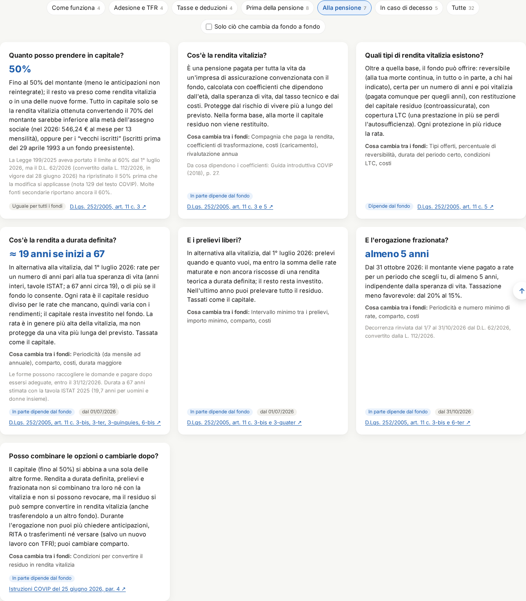
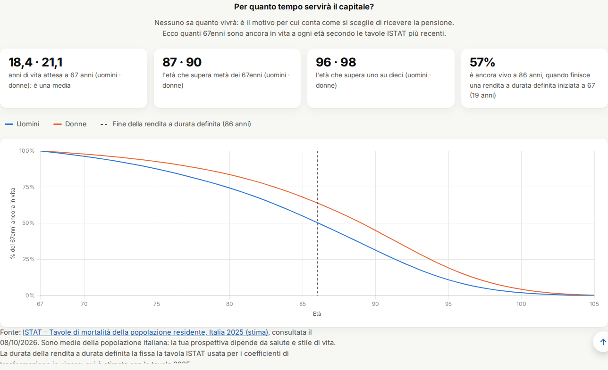

# Guida all'uso

Questa guida spiega come leggere la dashboard **Fondi pensione aperti a confronto** e, nell'ultima parte,
come aggiornare i dati e pubblicare una nuova versione.

> ℹ️ **Progetto personale**, nato per uso privato e pubblicato su GitHub a puro scopo dimostrativo: non è un servizio rivolto al pubblico. L'autore non è affiliato a COVIP, ai gestori dei fondi o a Ciao Elsa.
>
> ⚠️ **Non è consulenza finanziaria.** I dati arrivano in parte da una fonte secondaria (Ciao Elsa) e contengono
> anomalie note. Prima di aderire a un fondo leggi sempre la **Nota informativa**, la **Scheda costi** e
> l'**ISC (Indicatore Sintetico dei Costi)** pubblicati dal fondo e da [COVIP](https://www.covip.it).

Per un giro veloce c'è anche la [presentazione interattiva](../presentazione/): le frecce ← → cambiano argomento,
↑ ↓ entrano nei dettagli.

## Indice

1. [Panoramica](#panoramica)
2. [Tabella dei fondi](#tabella-dei-fondi)
3. [Dettaglio di un fondo](#dettaglio-di-un-fondo)
4. [Grafico commissione e rendimento](#grafico-commissione-e-rendimento)
5. [Confronto per categoria](#confronto-per-categoria)
6. [Regole e longevità](#regole-e-longevità)
7. [Qualità dei dati](#qualità-dei-dati)
8. [Come funziona un fondo pensione](#come-funziona-un-fondo-pensione): le regole spiegate, dal TFR alla pensione e al decesso
9. [Glossario](#glossario)
10. [Come usare i dati per scegliere](#come-usare-i-dati-per-scegliere)
11. [Per chi mantiene il progetto](#per-chi-mantiene-il-progetto)

## Panoramica


Sotto il titolo c'è il **menu delle sezioni**, che resta fisso in alto mentre scorri ed evidenzia la sezione in cui
ti trovi: cliccando una voce ci salti direttamente. Dopo un po' di scorrimento compare in basso a destra il pulsante
**↑** per tornare all'inizio della pagina (c'è anche in questa guida).

Subito dopo ci sono quattro **riquadri di riepilogo**:

| Riquadro | Significato |
|---|---|
| Fondi pensione aperti | Quanti fondi ci sono nell'[elenco dei fondi iscritti all'Albo COVIP](https://www.covip.it/la-covip-e-la-sua-attivita/albo-fondi-pensione/elenco-fondi-albo), con il filtro *Tipologia: Sezione II – Fondi pensione aperti* |
| Con dati di dettaglio | Quanti hanno costi e comparti compilati (gli altri hanno solo nome e sito) |
| Comparti | Le linee di investimento in totale, e quante hanno un rendimento a 10 anni |
| Comparti con anomalie | Quante linee hanno dati da verificare o non confrontabili (porta alla sezione Qualità dei dati) |

La pagina funziona anche da telefono e segue il tema chiaro o scuro del dispositivo.


## Tabella dei fondi


- **Ricerca**: scrivi parte del nome del fondo o della società (es. `amundi`, `zurich`).
- **Filtri**:
  - *Solo con dati* nasconde i fondi senza scheda;
  - *ESG* mostra i fondi con linee sostenibili;
  - *Life cycle* mostra i fondi con un percorso che riduce il rischio con l'età;
  - *Sottoscrivibile online* mostra i fondi a cui si aderisce online tramite Ciao Elsa.

  Il contatore a destra indica quanti fondi restano.
- **Ordinamento**: clicca su un'intestazione per ordinare, clicca di nuovo per invertire. I valori mancanti (—)
  restano sempre in fondo.
- **⚠️** accanto al nome segnala note o anomalie: passa il mouse sopra l'icona, oppure apri il dettaglio, per leggerle.
  Il ⚠️ accanto a *Max % azioni* vuol dire che il valore è probabilmente falsato da un comparto con dati invertiti.
- **Comparti**: se compare il riquadro giallo "*N* dichiarate", la fonte dichiara un numero di linee diverso da quelle trovate.
- **Caratteristiche**: etichette blu per *ESG*, *Life cycle* e *Online* (sottoscrivibile online); "Online: lista d'attesa"
  in grigio. Per selezionare i fondi con queste caratteristiche usa i filtri sopra la tabella.
- **Schermi stretti**: se la tabella non entra in larghezza, scorre dentro un riquadro con l'intestazione e la colonna
  *Fondo* fisse, e la barra orizzontale resta sempre visibile.
- **Fonti**: *Sito* apre la pagina ufficiale del fondo, *Scheda* apre la scheda di Ciao Elsa da cui vengono i dati.

Le righe in grigio sono i fondi senza dati di dettaglio.

## Dettaglio di un fondo

Clicca sul nome di un fondo (nella tabella, nel grafico o nelle classifiche) per aprire il dettaglio.


- Il **riquadro giallo** riporta le note della fonte e le anomalie rilevate in automatico.
- I **costi fissi** sono: spese di adesione (una tantum), spese annue fisse e costo percentuale su ogni versamento.
- Ogni **comparto** mostra:
  - la categoria;
  - l'asset allocation, con una barra blu per le azioni e azzurra per le obbligazioni;
  - il rendimento netto medio annuo, con il **periodo** su cui è calcolato. Un'etichetta gialla indica 3 o 5 anni, non confrontabili con i 10;
  - la commissione di gestione annua;
  - le note.
- L'indirizzo della pagina cambia (es. `…/#fondo=aureo`): puoi copiarlo per condividere direttamente quel fondo.
- Per chiudere: tasto **Esc**, il pulsante ✕ oppure un clic fuori dalla finestra.

## Grafico commissione e rendimento


Ogni punto è un **comparto**. In orizzontale c'è quanto costa ogni anno (commissione di gestione), in verticale
quanto ha reso in media ogni anno (al netto dei costi). **In alto a sinistra** ci sono i comparti economici e con il rendimento passato più alto.

- **Colori e forme** indicano la categoria: ● azionari, ▲ bilanciati, ■ obbligazionari, ◆ garantiti.
  Clicca su una voce della legenda per nasconderla o mostrarla.
- Di default ci sono **solo i rendimenti a 10 anni**. *Includi i rendimenti a 3 e 5 anni* aggiunge gli altri
  con un **simbolo vuoto**: non vanno confrontati con quelli pieni.
- **Evidenzia fondo** sbiadisce tutto tranne i comparti del fondo scelto.
- Passa il mouse su un punto per i dettagli; cliccalo per aprire il fondo.


Confronta solo punti dello **stesso colore**: un azionario rende di più di un obbligazionario perché rischia di più, non perché è "migliore".

## Confronto per categoria


Per ogni categoria (AZN, BIL, OBB, GAR) la scheda mostra:

- quanti comparti ci sono, la **commissione mediana** e il **rendimento mediano a 10 anni**;
- i comparti con la commissione più bassa e più alta;
- i comparti con il rendimento a 10 anni più alto e più basso.

La categoria OBB riunisce gli obbligazionari *misti* e *puri*. Le categorie sono quelle dichiarate dalla fonte:
alcuni comparti hanno un'asset allocation incoerente con la propria categoria, e sono segnalati con ⚠️.

## Regole e longevità

La sezione **Regole** riassume, in schede, le regole che la legge fissa per tutti i fondi pensione: versamenti e TFR,
tasse, anticipazioni e riscatti, opzioni alla pensione, decesso. Le spiegazioni complete sono nel capitolo
[Come funziona un fondo pensione](#come-funziona-un-fondo-pensione).



- **Temi**: scegli un tema con le pillole in alto (il numero indica quante regole contiene) oppure *Tutte*.
- **Solo ciò che cambia da fondo a fondo** nasconde le regole uguali ovunque: restano quelle da confrontare tra i fondi.
- Ogni scheda ha la **domanda**, il **valore chiave** in evidenza, la regola in parole semplici e, in basso:
  - *Uguale per tutti i fondi* oppure *Dipende dal fondo* (con l'elenco di cosa cambia);
  - la data di entrata in vigore, se la regola è nuova;
  - il **riferimento normativo**, che apre la fonte ufficiale (passa il mouse per vedere quale e quando è stata consultata).
- Le note in grigio segnalano le differenze tra le fonti: ad esempio, molte fonti riportano ancora il 60% in capitale
  alla pensione, ma il limite è rimasto al 50%.

Sotto le regole, **Per quanto tempo servirà il capitale?** mostra, con le tavole ISTAT 2025, quanti 67enni sono ancora
in vita a ogni età. La linea tratteggiata indica dove finisce una rendita a durata definita iniziata a 67 anni.



Nel **dettaglio di ogni fondo**, in fondo, c'è l'elenco di cosa verificare nei suoi documenti su pensione e decesso.

## Qualità dei dati


- **Copertura**: quanti fondi hanno dati di dettaglio.
- **Anomalie aperte**: comparti con dati sospetti o non confrontabili. Le anomalie rilevate in automatico sono:

  | Anomalia | Cosa significa |
  |---|---|
  | % azioni + % obbligazioni diversa da 100% | L'asset allocation non torna |
  | Comparto garantito/prudente con più del 50% di azioni | Quasi certamente azioni e obbligazioni sono invertite nella fonte |
  | % azioni incoerente con la categoria | Es. un "azionario" con il 30% di azioni |
  | Rendimento non a 10 anni | Calcolato su 3 o 5 anni: non confrontabile |
  | Rendimento o commissione mancante | La fonte non li riporta |

- **Fondi senza dati**: un'etichetta per fondo, che apre la sua pagina ufficiale.
- **Note sui fondi**: le prime 6 sono sempre visibili, ognuna su due righe; *Mostra tutte* apre l'elenco completo.
  Clicca sul fondo per leggere la nota per intero.
- **Fonti** usate.

I dati **non vengono corretti in silenzio**: restano come nella fonte, con la segnalazione, finché qualcuno non li verifica sulla Scheda costi ufficiale.

## Come funziona un fondo pensione

Questo capitolo risponde alle domande più comuni su come funziona un fondo pensione e su cosa succede al momento della
pensione e in caso di decesso. Le regole sono quelle **in vigore all'8 ottobre 2026**, verificate sui testi ufficiali
elencati in fondo; la sezione [Regole](../#regole) della dashboard le riassume con il link alla fonte di ciascuna.

> La riforma della Legge di Bilancio 2026 (Legge 199/2025) ha cambiato molte regole sulle prestazioni, e alcune
> correzioni successive non sono ancora arrivate ovunque: diversi siti riportano, per esempio, il 60% in capitale,
> mentre il limite è rimasto al **50%**. In caso di dubbio fanno fede la legge e i documenti del tuo fondo.

### 1. Come funziona, nella maggior parte dei casi

Un fondo pensione è un **conto individuale**: tutto quello che versi resta tuo, separato dal patrimonio di chi gestisce
il fondo. Funziona in due fasi.

**Accumulo** (fino alla pensione)
- Si versano contributi tuoi, eventualmente del datore di lavoro, e il **TFR** se sei dipendente.
- I soldi sono investiti nel **comparto** che scegli: azionario, bilanciato, obbligazionario o garantito. In alternativa
  c'è un percorso **life cycle**, che riduce il rischio man mano che ti avvicini alla pensione.
- Il valore del conto (**posizione individuale**) cresce con i versamenti e i rendimenti, al netto dei costi. È a
  **contribuzione definita**: si sa quanto si versa, non quanto si riceverà. Non c'è un importo garantito, salvo nei
  comparti con garanzia.
- Ci sono vantaggi fiscali: contributi deducibili fino a **5.300 € l'anno** (dal 2026), rendimenti tassati al **20%**
  (12,5% sui titoli di Stato) invece del 26%.

**Erogazione** (dalla pensione)
- Si ha diritto alla prestazione quando maturano i requisiti della pensione pubblica (ad esempio quella di
  vecchiaia) e si hanno almeno **5 anni di partecipazione**.
- Non sei obbligato a chiederla subito: puoi lasciare il conto investito, e anche continuare a versare se alla data
  del pensionamento hai almeno un anno di contributi.

### 2. Il TFR: investirlo, e riaverlo prima o alla pensione

**Destinarlo al fondo**
- Il TFR è il 6,91% della retribuzione lorda annua che l'azienda accantona ogni anno.
- Dal **1° luglio 2026** chi è alla **prima assunzione** nel settore privato aderisce in automatico al fondo negoziale del
  proprio contratto, con tutto il TFR. Entro **60 giorni** può cambiare: mandare tutto il TFR a un altro fondo scelto
  liberamente (anche a uno dei fondi aperti di questa dashboard) oppure tenerlo in azienda.
- Chi era già assunto prima continua con le regole che valevano allora (scelta entro 6 mesi, silenzio-assenso).
- Puoi passare in ogni momento dal TFR in azienda al fondo, ma **non il contrario**: una volta mandato al fondo, il TFR
  futuro resta destinato alla previdenza complementare. Puoi comunque cambiare fondo.
- Attenzione al **contributo del datore di lavoro**: di solito i contratti lo prevedono solo per il fondo negoziale di
  categoria. Scegliendo un fondo aperto potresti rinunciarvi; dal 31 ottobre 2026, però, chi **trasferisce** la
  posizione ha diritto a portarsi dietro TFR e contributo del datore.

**Investirlo**
- Il TFR finisce nel comparto che hai scelto. In azienda invece si rivaluta dell'**1,5% più il 75% dell'inflazione**,
  senza rischi ma anche senza rendimenti di mercato.
- Puoi cambiare comparto nel tempo (lo *switch*), rispettando il periodo minimo previsto dal regolamento.

**Riaverlo prima della pensione**

| Motivo | Quanto | Quando | Tasse |
|---|---|---|---|
| Spese sanitarie gravissime (tue, del coniuge, dei figli) | fino al 75% | in qualsiasi momento | dal 15% al 9% |
| Acquisto o ristrutturazione della prima casa (tua o dei figli) | fino al 75% | dopo 8 anni di iscrizione | 23% |
| Altre esigenze, senza giustificare il motivo | fino al 30% | dopo 8 anni di iscrizione | 23% |
| Inoccupazione tra 12 e 48 mesi, mobilità, cassa integrazione | 50% (riscatto parziale) | quando si verifica | dal 15% al 9% |
| Invalidità che riduce la capacità di lavoro a meno di 1/3, inoccupazione oltre 48 mesi | 100% (riscatto totale) | quando si verifica | dal 15% al 9% |
| Perdita dei requisiti di partecipazione per altre cause | 100% | nelle adesioni individuali solo se perdi lo status di lavoratore | 23% |
| RITA: hai smesso di lavorare e mancano al massimo 5 anni alla pensione di vecchiaia (o 10 anni, se sei inoccupato da più di 24 mesi) | tutto o parte, **a rate** fino alla pensione | con almeno 5 anni di partecipazione | dal 15% al 9% |

- Le anticipazioni si possono chiedere più volte, fino al 75% complessivo, e **reintegrare** quando vuoi.
- Ogni prelievo riduce la pensione futura. Le aliquote "dal 15% al 9%" scendono di 0,30 punti per ogni anno di
  partecipazione oltre il quindicesimo: il 9% si raggiunge dopo 35 anni.
- Dopo 2 anni puoi **trasferire** tutta la posizione a un altro fondo, senza tasse.

### 3. Alla pensione: le opzioni

Al momento della pensione puoi prendere **fino al 50% in capitale** (meno le anticipazioni non reintegrate). Tutto il
resto va in **una sola** di queste forme:

| Forma | Come funziona | Se vivi a lungo | Alla tua morte | Tasse |
|---|---|---|---|---|
| **Rendita vitalizia** | Una pensione per tutta la vita, pagata da un'assicurazione convenzionata con il fondo | Continua finché vivi: è l'unica che protegge dal **rischio di longevità** | Nella forma base si ferma: il capitale residuo non viene restituito | dal 15% al 9% |
| **Rendita a durata definita** (dal 1/7/2026) | Rate per un numero di anni pari alla tua speranza di vita (circa 19 se inizi a 67), o di più se il fondo lo consente; il capitale resta investito nel fondo | Le rate finiscono: oltre quella durata non ricevi più nulla | Il capitale residuo va alle persone che hai indicato | dal 15% al 9% |
| **Prelievi liberi** (dal 1/7/2026) | Prelevi quando vuoi, entro le rate maturate di una rendita teorica a durata definita | Come sopra | Come sopra | dal 15% al 9% |
| **Erogazione frazionata** (dal 31/10/2026) | Rate per un periodo che scegli, di almeno 5 anni | Come sopra | Come sopra | dal 20% al 15% |

- **Tutto in capitale** si può avere solo se la rendita vitalizia ottenuta dal 70% del montante sarebbe inferiore alla
  metà dell'assegno sociale (nel 2026: circa 3.550 € l'anno), oppure se sei un "vecchio iscritto" (iscritto prima del
  29 aprile 1993 a un fondo preesistente).
- **Le tre forme nuove** sono alternative alla vitalizia: non si combinano tra loro e non si possono revocare. Il
  residuo però si può sempre convertire in rendita vitalizia, anche trasferendolo a un altro fondo.
- Durante l'erogazione non puoi più chiedere anticipazioni, RITA o trasferimenti, né versare (salvo un nuovo lavoro con
  TFR). Puoi però cambiare comparto.
- **Varianti della vitalizia**: il fondo può offrire la rendita **reversibile** (alla tua morte continua, in tutto o in
  parte, a una persona che indichi), **certa** per 5 o 10 anni e poi vitalizia, **con restituzione del capitale
  residuo** (*controassicurata*), **con copertura LTC** (una prestazione in più se perdi l'autosufficienza). Ogni
  protezione in più costa: la rata è più bassa.

#### Regola generale o condizione del fondo?

| Uguale per tutti i fondi (lo dice la legge) | Cambia da fondo a fondo (Documento sulle rendite e Supplemento alla Nota informativa) |
|---|---|
| Requisiti (pensione pubblica + 5 anni di partecipazione) | Quali varianti della vitalizia offre (reversibile, certa, controassicurata, LTC) |
| Capitale fino al 50%, e al 100% solo nei casi previsti | Compagnia che paga la vitalizia, **coefficienti di trasformazione** (quanta rendita per ogni euro), costi e rivalutazione |
| Obbligo di offrire rendita a durata definita e prelievi (frazionata dal 31/10/2026) | Periodicità delle rate, comparto in cui resta il capitale, costi delle nuove forme |
| Tasse, regole sul decesso, irrevocabilità delle nuove forme | Possibilità di una durata più lunga e condizioni per convertire il residuo in vitalizia |

Le **regole** sono uguali ovunque; le **condizioni economiche** (quanta rendita ottieni e quanto costa) no. Per
questo, prima della pensione conviene confrontare le condizioni di rendita, ed eventualmente trasferire la posizione.

### 4. In caso di decesso

| Quando | Chi riceve | Cosa | Tasse |
|---|---|---|---|
| **Prima della pensione** | I beneficiari che hai designato (persone o enti); se non ne hai indicati, gli eredi | Tutta la posizione | dal 15% al 9% |
| Prima della pensione, **senza beneficiari né eredi** | Finalità sociali (adesioni individuali) oppure il fondo (adesioni collettive) | Tutta la posizione | — |
| Durante la **rendita vitalizia base** | Nessuno | La rendita si ferma; il capitale residuo resta all'assicurazione e paga le rendite di chi vive più a lungo | — |
| Durante una **vitalizia reversibile** | La persona indicata | La rendita, in tutto o in parte, finché quella persona vive | da verificare |
| Durante una **vitalizia certa** (5 o 10 anni) | La persona indicata | Le rate che mancano alla fine del periodo certo | da verificare |
| Durante una **vitalizia controassicurata** | La persona indicata | Il capitale residuo non ancora pagato | da verificare |
| Durante **durata definita, prelievi o frazionata** | Le persone indicate quando hai scelto la prestazione | Il capitale residuo, rimasto investito | dal 15% al 9% |

- La designazione dei beneficiari si fa con un modulo del fondo e si può cambiare. Per le forme nuove è **obbligatoria**
  al momento della scelta.
- Secondo la COVIP chi riceve la posizione la acquisisce **a titolo proprio**, non come eredità: per esempio spetta anche
  a un erede che abbia rinunciato all'eredità.
- Per le somme pagate ai beneficiari di rendite reversibili, certe o controassicurate, la tassazione va verificata nel
  *Documento sul regime fiscale* del fondo. Per l'imposta di successione serve un professionista: dipende dal caso.

**E quando muoiono anche loro?**
- I soldi già pagati ai beneficiari (riscatto, capitale residuo, capitale preso alla pensione) diventano loro a tutti
  gli effetti: alla loro morte seguono le normali regole della loro successione.
- Le rendite invece si estinguono: una reversibile si ferma alla morte del beneficiario e non lascia nulla.
- Se muore anche il beneficiario di una rendita certa prima della fine del periodo, contano le condizioni del contratto.
- In sintesi, il capitale "si perde" solo in due casi: con la rendita vitalizia (è il prezzo dell'assicurazione contro
  la longevità) e quando non ci sono né beneficiari né eredi.

### 5. Godersi il capitale senza sapere quanto si vivrà

Il problema è reale. Secondo le tavole ISTAT 2025, a 67 anni la vita attesa è di **18,4 anni per gli uomini e 21,1 per
le donne**, ma è solo una media:
- uno su quattro muore prima di **80 anni** (uomini) o **84** (donne);
- metà supera **87** (uomini) o **90** (donne);
- uno su dieci arriva a **96** (uomini) o **98** (donne).


Chi a 67 anni sceglie la rendita a durata definita la vede finire a **86 anni**, quando è ancora vivo il **57%** delle
persone (il 50% degli uomini e il 64% delle donne). Non esiste una scelta migliore in assoluto, ma ci sono criteri
condivisi per decidere.

1. **Separa il necessario dal resto.** Le spese che dovrai sostenere comunque (casa, salute, vita quotidiana) vanno
   coperte con entrate che durano tutta la vita: la pensione pubblica, più eventualmente la rendita vitalizia. Il
   capitale e i prelievi servono per progetti, imprevisti e per quello che vuoi lasciare.
2. **Il capitale (fino al 50%) non è protetto dalla longevità.** Ha senso per spese precise (estinguere un debito, una
   riserva per le emergenze), non come pensione. Le tasse sono le stesse della rendita.
3. **La rendita vitalizia è un'assicurazione**: paga finché vivi, anche a 100 anni, e chi muore presto finanzia chi
   vive a lungo. Se ti preoccupa "perdere" il capitale, le varianti reversibile, certa o controassicurata proteggono
   partner o eredi, al prezzo di una rata più bassa.
4. **Le nuove forme danno flessibilità ed eredità, ma possono finire.** Le rate variano con i mercati e la durata
   standard copre la vita *media*. Per ridurre il rischio puoi:
   - chiedere una durata più lunga, se il fondo lo consente;
   - tenere il capitale in un comparto prudente;
   - pensare a un **approccio in due tempi**: prelievi o rate nei primi anni, poi conversione del residuo in rendita
     vitalizia a un'età più avanzata, quando ogni euro dà una rendita più alta. La legge lo consente, ma le condizioni
     le fissa il fondo.
5. **Non c'è fretta di chiedere la prestazione.** Puoi lasciare il conto investito, e continuare a versare, anche dopo
   la pensione: la rendita chiesta più tardi è più alta. Nel frattempo però il capitale resta esposto ai mercati.
6. **Se smetti di lavorare prima, valuta la RITA** come ponte fino alla pensione: rate tassate dal 15% al 9%, con il
   resto che rimane investito.
7. **Attenzione alle tasse.** Le anticipazioni per "altre esigenze" pagano il 23%, le prestazioni dal 15% al 9%;
   l'erogazione frazionata è tassata più della rendita a durata definita (dal 20% al 15%).
8. **Confronta le condizioni di rendita tra i fondi** (coefficienti, costi, varianti offerte) prima di andare in
   pensione: dopo 2 anni di partecipazione puoi trasferire la posizione dove le condizioni sono migliori.
9. **Designa i beneficiari e tienili aggiornati**, sia durante l'accumulo sia quando scegli una delle forme nuove.

Queste scelte dipendono da salute, altre entrate, patrimonio, famiglia e propensione al rischio: per una decisione
personale serve un consulente indipendente. Questa guida non è consulenza finanziaria.

#### Fonti consultate (8 ottobre 2026)

- [D.Lgs. 252/2005, testo COVIP aggiornato alla Legge 199/2025](https://www.covip.it/sites/default/files/legislazione_fondi/decreto_legislativo_5_dicembre_2005_n_252.pdf): artt. 8, 11 e 14
- [Legge 30 dicembre 2025, n. 199 (estratto COVIP)](https://www.covip.it/sites/default/files/legislazione_fondi/legge_bilancio_2026.pdf)
- [COVIP, Istruzioni sulle prestazioni, deliberazione del 25 giugno 2026](https://www.covip.it/sites/default/files/provvedimenti/istruzioni_prestazioni_25_06_2026.pdf)
- [COVIP, Esempio di supplemento alla Nota informativa per i fondi aperti (28 luglio 2026)](https://www.covip.it/sites/default/files/notizie/esempio_supplementoni_fpa.pdf)
- COVIP, FAQ su [prestazioni](https://www.covip.it/per-il-cittadino/educazione-previdenziale/faq/prestazioni), [TFR](https://www.covip.it/per-il-cittadino/educazione-previdenziale/faq/conferimento-tfr) e [trattamento fiscale](https://www.covip.it/per-il-cittadino/educazione-previdenziale/faq/trattamento-fiscale) (in parte non ancora aggiornate alla riforma)
- COVIP, risposte a quesito su [premorienza e rinuncia all'eredità](https://www.covip.it/normativa/fondi-pensione/quesiti/premorienza-rinuncia-alleredita) e sul [riscatto nelle adesioni individuali](https://www.covip.it/normativa/fondi-pensione/quesiti/risposta-quesito-tema-riscatto-della-posizione-individuale-parte)
- [COVIP, Guida introduttiva alla previdenza complementare (2018)](https://www.covip.it/sites/default/files/guidaintroduttivaallaprevidenzacomplementare.pdf), per i concetti generali
- [ISTAT, Tavole di mortalità della popolazione residente, Italia 2025](https://demo.istat.it/app/?i=TVM&l=it)

## Glossario

| Termine | Significato |
|---|---|
| **Fondo pensione aperto** | Fondo di previdenza complementare istituito da banche, assicurazioni o SGR, aperto a tutti |
| **Comparto / linea** | Una delle opzioni di investimento del fondo, ognuna con un proprio profilo di rischio |
| **AZN** | Azionario: in prevalenza azioni, rischio e potenziale di rendimento più alti |
| **BIL** | Bilanciato: un mix di azioni e obbligazioni |
| **OBB misto / puro** | Obbligazionario: soprattutto (misto) o solo (puro) obbligazioni |
| **GAR** | Garantito: restituzione del capitale (o un rendimento minimo) in certi casi previsti dal regolamento |
| **Commissione di gestione** | Percentuale del patrimonio prelevata ogni anno per la gestione |
| **Spese di adesione** | Costo una tantum all'iscrizione |
| **Spese annue fisse** | Importo fisso prelevato ogni anno |
| **Rendimento netto medio annuo** | Rendimento medio annuo del comparto, già al netto dei costi, sul periodo indicato |
| **Life cycle** | Percorso che sposta automaticamente l'investimento verso comparti più prudenti man mano che ci si avvicina alla pensione |
| **ESG** | Linee che tengono conto di criteri ambientali, sociali e di governance |
| **ISC** | Indicatore Sintetico dei Costi di COVIP: il costo complessivo su 2, 5, 10 e 35 anni, confrontabile tra tutti i fondi |
| **Posizione individuale / montante** | Il valore del tuo conto nel fondo: versamenti più rendimenti, meno costi e prelievi |
| **Anticipazione** | Un prelievo parziale prima della pensione, per i motivi previsti dalla legge; si può reintegrare |
| **Riscatto** | Il ritiro di metà o di tutta la posizione in casi precisi (perdita del lavoro, invalidità, decesso) |
| **RITA** | Rendita integrativa temporanea anticipata: la posizione pagata a rate fino alla pensione di vecchiaia, per chi smette di lavorare prima |
| **Rendita vitalizia** | Pensione pagata per tutta la vita da un'assicurazione; protegge dal rischio di vivere a lungo |
| **Coefficiente di trasformazione** | Il numero che trasforma il capitale in rendita annua: dipende da età, speranza di vita, tasso tecnico e costi |
| **Rendita reversibile** | Alla morte di chi la riceve, continua (in tutto o in parte) a una persona indicata |
| **Rendita certa e poi vitalizia** | Pagata comunque per 5 o 10 anni (anche ai beneficiari, se si muore prima), poi finché si vive |
| **Rendita controassicurata** | Rendita vitalizia che, alla morte, restituisce ai beneficiari il capitale non ancora pagato |
| **LTC (Long Term Care)** | Copertura che aggiunge una prestazione se si perde l'autosufficienza |
| **Rendita a durata definita** | Dal 2026: rate per un numero di anni pari alla speranza di vita; il capitale resta investito e il residuo va ai beneficiari |
| **Prelievi liberamente determinabili** | Dal 2026: prelievi a scelta, entro le rate maturate di una rendita teorica a durata definita |
| **Erogazione frazionata** | Dal 31 ottobre 2026: il capitale pagato a rate per almeno 5 anni; tassazione dal 20% al 15% |
| **Rischio di longevità** | Il rischio di vivere più a lungo di quanto il capitale riesca a coprire |
| **Beneficiari designati** | Le persone (o gli enti) che indichi per ricevere la posizione in caso di decesso |
| **Vecchio iscritto** | Chi è iscritto dal 29 aprile 1993 o prima a un fondo preesistente: può prendere tutto in capitale |
| **Documento sulle rendite** | Documento del fondo con tipi di rendita, coefficienti e costi della fase di erogazione |

## Come usare i dati per scegliere

1. **Parti dal tuo orizzonte**: quanti anni mancano alla pensione? Più è lungo, più rischio puoi sostenere.
2. **Scegli la categoria**, poi confronta **solo comparti della stessa categoria**, nel grafico o nelle schede.
3. **Guarda i costi**: su 30 anni anche lo 0,5% in più all'anno pesa molto sul capitale finale.
4. **Non inseguire il rendimento passato**: è un indizio, non una promessa. Diffida dei confronti tra periodi diversi.
5. **Controlla le ⚠️** e verifica sempre su Nota informativa, Scheda costi e ISC del fondo.
6. Valuta anche il **fondo negoziale** della tua categoria, se esiste: spesso costa meno e c'è il contributo del datore di lavoro.
7. **Pensa anche all'uscita**: tipi di rendita offerti, coefficienti e costi della fase di erogazione cambiano da fondo
   a fondo (vedi [Alla pensione: le opzioni](#3-alla-pensione-le-opzioni)).

## Per chi mantiene il progetto

### Aggiornare i dati

1. Modifica `data/fondi-pensione-covip.xlsx` **in Excel** e salva: le formule si ricalcolano e i valori restano in cache.
   Nel devcontainer puoi aprire il file in sola lettura con l'estensione *Spreadsheet Viewer*.
2. Rigenera i JSON: `python scripts/export_xlsx.py`. Lo script si ferma se trova errori di schema.
3. Esegui i test: `python -m unittest discover -s tests -v`.

### Provare il sito prima di pubblicarlo

```bash
./scripts/anteprima.sh          # export + test + server su http://localhost:8000
./scripts/anteprima.sh --veloce # senza test
```

In VS Code puoi anche usare *Terminale → Esegui attività… → Anteprima GitHub Page*. In Codespaces la porta 8000 viene
inoltrata in automatico e si apre l'anteprima.

### Pubblicare: pull request → deploy → release

1. Lavora su un branch (es. `dev`) e apri una **pull request verso `master`**. La CI esegue export, test e smoke test
   del sito, e scrive nel riepilogo la **versione che verrà pubblicata**.
2. Al **merge** il workflow *Deploy GitHub Page e release*:
   - calcola la nuova versione;
   - pubblica il sito su GitHub Pages;
   - crea il tag `vX.Y.Z` e la release, con le note generate dai commit e in allegato i dati della versione
     (JSON), il workbook Excel, lo zip del sito pubblicato e i checksum SHA-256. Gli allegati si scaricano dalla
     pagina [Releases](https://github.com/andreagalle/goodbye-elsa/releases/latest) del repository. La sezione
     *Packages* di GitHub è un'altra cosa: un registro per pacchetti npm, Maven, immagini Docker e simili, che qui
     resta vuoto.
3. Regole di versione:
   - **minor** se c'è almeno un commit `sito:`, `script:` o `feat:`;
   - **patch** per tutto il resto (`dati:`, `docs:`, `fix:`, `ci:`…);
   - la **major** non viene mai incrementata in automatico: solo con la label `release:major` sulla PR o
     con l'avvio manuale del workflow, e solo su decisione del responsabile del progetto.

### Aggiornare guida, presentazione e screenshot

```bash
python scripts/screenshots.py   # rigenera docs/guida/img/ con i dati correnti
```

Ogni modifica alla dashboard deve aggiornare insieme questa guida (`docs/guida/GUIDA.md`), la presentazione
(`docs/presentazione/index.html`), gli screenshot e `CLAUDE.md`.
